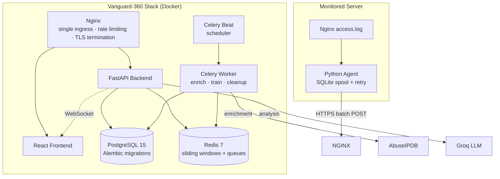

<div align="center">

# 🛡️ Vanguard-360

### Real-time cyber attack monitoring and threat intelligence platform — hybrid rule + ML detection, live world map, and remote collector fleet management for self-hosted infrastructure.

[](https://vanguard.cuetinsights.dev)
[](https://aws.amazon.com/ec2/)
[](./LICENSE)
[](backend/requirements.txt)
[](https://fastapi.tiangolo.com)
[](https://react.dev)
[](https://www.typescriptlang.org)
[](https://vitejs.dev)
[](https://www.postgresql.org)
[](https://redis.io)
[](./docker-compose.yml)

<br />

Vanguard-360 is a production-style security operations dashboard that brings **servers, agents, and operators** into one self-hosted system — with a hybrid rule + behavioural-ML detection engine, deduplicated alerting, and an end-to-end ingestion pipeline that survives retries and out-of-order delivery.

Live now at **[vanguard.cuetinsights.dev](https://vanguard.cuetinsights.dev)** — running on an **AWS EC2** instance.

[🐛 Report Bug](https://github.com/sakawatkabir13/real-time-cyber-attack-and-monitoring-map/issues) · [✨ Request Feature](https://github.com/sakawatkabir13/real-time-cyber-attack-and-monitoring-map/issues)

</div>

---

## ✨ Why Vanguard-360?

Most teams running their own infrastructure have **no real-time visibility** into who's hitting their services, what payloads they're sending, or whether an attack is building. **Vanguard-360** plugs that gap — a lightweight agent tails your access logs, the backend classifies every event through deterministic signatures plus per-source behavioural models, and the dashboard streams detections onto a live world map in real time.

> ⚠️ **Defensive use only.** Vanguard-360 is built to monitor systems **you own or have explicit permission to monitor**. Do not point it at third-party infrastructure — the bundled agent is shipped as a detection tool, not an offensive one.

---

## 📑 Table of Contents

1. [✨ Features](#-features)
2. [🖼️ Screenshots](#-screenshots)
3. [🧱 Tech Stack](#-tech-stack)
4. [🏗️ Architecture](#-architecture)
5. [🚀 Quick Start](#-quick-start)
6. [🧪 Available Scripts](#-available-scripts)
7. [📁 Project Structure](#-project-structure)
8. [🔐 Environment Variables](#-environment-variables)
9. [🐳 Docker Deployment](#-docker-deployment)
10. [🛰️ Remote Agent](#-remote-agent)
11. [🛡️ Defensive-Use Disclaimer](#-defensive-use-disclaimer)
12. [🗺️ Roadmap](#-roadmap)
13. [🤝 Contributing](#-contributing)
14. [🛡️ Security](#-security)
15. [📄 License](#-license)
16. [🙏 Acknowledgements](#-acknowledgements)

---

## ✨ Features

### 🧠 For Detection Engineers
- 🩺 **Hybrid detection pipeline** — deterministic signatures (SQLi, XSS, path traversal, brute force, scanner/recon, DDoS) + per-source and per-server IsolationForest behavioural models
- 🧪 **Trained on real traffic**, not synthetic data — models only engage once enough clean windows have accumulated
- 🔁 **Zero-downtime hot-reload** the moment a newly trained model passes validation
- 📈 **Sliding-window rate tracking** in Redis for volumetric detection

### 🛰️ For Operators
- 🧾 **Idempotent ingestion** — safe against agent retries and duplicate delivery
- 🌍 **Live world map** of attack origins with geo-located source IPs
- 🧯 **Deduplicated, persistent alerting** with acknowledge / resolve workflow and occurrence counters
- ⏸️ **Remote collector fleet management** — pause or resume log shipping per server from the dashboard, with heartbeat-based online / offline tracking
- 🧹 **Scheduled retention cleanup** so the database doesn't grow unbounded

### 🔐 For Platform Owners
- 🔑 Session-based dashboard auth with **HMAC-signed, constant-time-compared tokens**
- ⚡ Rate limiting on login, IP-lookup, and AI analysis endpoints
- 🚨 **Refuses to boot in production** with default or placeholder secrets
- 🧱 API docs disabled outside development
- 🔒 Single Nginx ingress — frontend and backend are strictly same-origin, no CORS configuration required in production

### 🧰 For Everyone
- 🤖 Optional **Groq-powered LLM** for plain-language threat summaries
- 🌐 Optional **AbuseIPDB** IP-reputation enrichment, cached and rate-limited
- 📜 Optional **historical log upload** with streaming analysis and progress polling
- 🎨 Theming and design tokens with **Tailwind CSS**
- 🧪 Backend tests with **Pytest** + frontend tests with **Vitest** + **Testing Library**

---

## 🖼️ Screenshots

> Placeholders ship as `.svg` files in `docs/screenshots/`. Replace with real `.png` (1280×720) screenshots after the first deploy.

| Dashboard | World Map |
| :---: | :---: |
|  |  |

| Live Alerts | Collector Control |
| :---: | :---: |
|  |  |

| IP Lookup | ML Status |
| :---: | :---: |
|  |  |

---

## 🏗️ Architecture



**Key flows**
- **Single ingress** — the bundled Nginx container is the **only** externally exposed service. The frontend and backend never accept direct traffic, so the whole stack is one port to reverse-proxy behind your own domain.
- **Idempotent ingestion** — every event carries a stable `event_id`; the backend enforces uniqueness so retries and out-of-order delivery never produce duplicates.
- **Detection pipeline** — for every ingested event: **volumetric check** → **signature rules** → **behavioural scoring** (only once enough clean data exists).
- **Alert deduplication** — high and critical severity events are coalesced into a single alert record with an occurrence counter rather than spamming duplicates.
- **Collector fleet** — each agent heartbeats in, reports its desired-state, and can be paused or resumed remotely. Offline state is derived from a stale-heartbeat threshold.

For deeper internals — state machines, queue/locking semantics, ERD, and deployment topology — see [`docs/ARCHITECTURE.md`](./docs/ARCHITECTURE.md).

---

## 📡 API Reference

All endpoints are served under `/api`, behind the bundled Nginx.

| Method | Endpoint | Auth | Description |
| --- | --- | --- | --- |
| `POST` | `/api/auth/login` | — | Authenticate and receive a session cookie |
| `POST` | `/api/auth/logout` | Session | End the current session |
| `GET` | `/api/auth/status` | Session | Check current auth state |
| `GET` | `/api/health` | — | Liveness + Redis/PostgreSQL connectivity check |
| `WS` | `/ws` | Session | Real-time threat and alert event stream |
| `POST` | `/api/ingest/batch` | Collector token | Agent log ingestion endpoint |
| `POST` | `/api/collector/heartbeat` | Collector token | Agent heartbeat + desired-state check-in |
| `GET` | `/api/collectors` | Session | List all known collector agents and their status |
| `POST` | `/api/collectors/{server_id}/command` | Session | Pause or resume a collector remotely |
| `GET` | `/api/events` | Session | Recent threat events |
| `GET` | `/api/stats` | Session | Aggregate dashboard statistics (cached) |
| `GET` | `/api/alerts` | Session | List deduplicated alerts, filterable by status |
| `PATCH` | `/api/alerts/{alert_id}/acknowledge` | Session | Acknowledge an alert |
| `GET` | `/api/ip-lookup/{ip}` | Session | Reputation and history for an IP |
| `POST` | `/api/analyze-threat` | Session | LLM-generated plain-language threat summary |
| `POST` | `/api/analyze-log-file` | Session | Upload and analyze a historical log file |
| `GET` | `/api/analysis-status` | Session | Progress of an in-flight log file analysis |
| `GET` | `/api/ml/status` | Session | Current model training/validation status |

---

## 🧱 Tech Stack

### Backend
| Layer | Technology |
| --- | --- |
| Runtime | **Python 3.11** |
| Framework | **FastAPI** (async) |
| ORM | **SQLAlchemy** (async) with `asyncpg` |
| Validation | **Pydantic v2** |
| Migrations | **Alembic** |
| Auth | Session cookies, **HMAC-signed**, constant-time compared |
| Machine Learning | **scikit-learn** (`IsolationForest`), `joblib` |
| Background tasks | **Celery** worker + beat |
| Tests | **Pytest** + `pytest-asyncio` |

### Frontend
| Layer | Technology |
| --- | --- |
| Framework | **React 18** |
| Language | **TypeScript 5** |
| Build tool | **Vite 5** |
| Styling | **Tailwind CSS** |
| Routing | **React Router** |
| Data fetching | **TanStack Query** |
| Real-time | **WebSocket** threat and alert stream |
| Tests | **Vitest** + **Testing Library** + **jsdom** |

### Database, Infrastructure & Tooling
| Layer | Technology |
| --- | --- |
| Database | **PostgreSQL 15** |
| Cache / Queue | **Redis 7** |
| Reverse proxy | **Nginx** (bundled) |
| Orchestration | **Docker Compose** |
| Lint | **Ruff** (backend), **ESLint** (frontend) |

---

## 🚀 Quick Start

### Prerequisites

- **Docker** & Docker Compose **v2.x+**
- `make` *(optional, for convenience targets)*

### 1. Clone the repository

```bash
git clone https://github.com/sakawatkabir13/real-time-cyber-attack-and-monitoring-map.git
cd real-time-cyber-attack-and-monitoring-map
```

### 2. Configure environment

```bash
cp .env.example .env
```

> 🔑 Generate strong secrets for every required field before bringing the stack up:
>
> ```bash
> openssl rand -hex 32
> ```

### 3. Launch the stack

```bash
docker compose up --build -d
```

On first boot the backend will:

1. Wait for PostgreSQL to be healthy.
2. Run `alembic upgrade head` (idempotent migrations).
3. Start the FastAPI API, the Celery worker, and the Celery beat scheduler.
4. Serve the React frontend through the bundled Nginx ingress.

### 4. Open the apps

| App | URL |
| --- | --- |
| 🖥️ Dashboard (local) | http://localhost:8080 |
| 🩺 Health check (local) | http://localhost:8080/api/health |
| 📘 API docs (local, development only) | http://localhost:8080/api/docs |
| 🌍 **Live (AWS EC2)** | **https://vanguard.cuetinsights.dev** |

To start monitoring a server, install the agent found in [`agent/`](agent/) on the machine you want to watch and point it at your Vanguard instance (e.g. `https://vanguard.cuetinsights.dev`).

---

## 🧪 Available Scripts

### Root (Docker Compose shortcuts)

| Command | Description |
| --- | --- |
| `docker compose up --build -d` | Build and start the entire stack in the background |
| `docker compose down` | Stop and remove containers |
| `docker compose restart` | Restart all services |
| `docker compose logs -f` | Follow logs from all services |
| `docker compose exec backend alembic upgrade head` | Apply migrations manually |
| `docker compose exec backend pytest -v` | Run the backend test suite inside the container |

### Backend (inside `backend/`)

```bash
ruff check .              # lint
pytest -v                 # run tests
alembic upgrade head      # apply migrations
uvicorn app.main:app --reload
```

### Frontend (inside `frontend/`)

| Script | Description |
| --- | --- |
| `npm run dev` | Start the Vite dev server with HMR |
| `npm run build` | Production build to `dist/` |
| `npm run preview` | Preview the production build locally |
| `npm run lint` | Run ESLint over the project |
| `npm run test` | Run the Vitest suite once |
| `npm run test:watch` | Run Vitest in watch mode |

### Agent (inside `agent/`)

| Script | Description |
| --- | --- |
| `python agent.py` | Start the agent with values from `agent.conf` |
| `python test_agent.py` | Self-test: spool rotation, retry, dry-run ingest |

---

## 📁 Project Structure

```
vanguard-360/
├── backend/                 # FastAPI service
│   ├── app/
│   │   ├── routers/         # ingest, alerts, collectors, auth
│   │   ├── services/        # detection engine, ML, alerting, geo lookup
│   │   ├── tasks/           # Celery: enrichment, training, cleanup
│   │   └── models/          # SQLAlchemy models
│   ├── alembic/             # migrations
│   ├── tests/               # Pytest suite
│   ├── Dockerfile
│   └── requirements.txt
├── frontend/                # Vite + React + TS dashboard
│   ├── src/
│   │   ├── components/      # dashboard widgets, charts, layouts
│   │   ├── hooks/           # data hooks (live feed, etc.)
│   │   ├── pages/           # dashboard, alerts, ip-lookup, settings
│   │   └── store/           # global client state
│   ├── tests/               # Vitest setup
│   ├── Dockerfile
│   └── package.json
├── agent/                   # remote log-shipping agent
│   ├── agent.py
│   ├── install.sh
│   ├── vanguard-agent.service
│   ├── test_agent.py
│   └── requirements.txt
├── nginx/                   # bundled ingress configuration
├── docs/
│   └── screenshots/         # README screenshot assets
├── .github/
│   ├── ISSUE_TEMPLATE/      # bug_report.yml, feature_request.yml
│   ├── workflows/ci.yml     # GitHub Actions CI
│   └── PULL_REQUEST_TEMPLATE.md
├── docker-compose.yml
├── .env.example
├── LICENSE
├── VPS_DEPLOYMENT_GUIDE.md
└── README.md
```

---

## 🔐 Environment Variables

All variables are loaded from `.env` via `pydantic-settings`. Server-side secrets **must never** be committed.

| Variable | Required | Description |
| --- | :---: | --- |
| `ENVIRONMENT` | ✅ | `development` \| `production` — production refuses placeholder secrets |
| `DATABASE_URL` | ✅ | Async PostgreSQL connection string |
| `DATABASE_SSL` | ⚙️ | `true` when connecting through TLS |
| `REDIS_URL` | ✅ | Redis connection string |
| `COLLECTOR_TOKEN` | ✅ | Shared secret agents use to authenticate ingestion |
| `SECRET_KEY` | ✅ | HMAC key for dashboard session tokens |
| `DASHBOARD_PASSWORD` | ✅ | Dashboard login credential |
| `SESSION_TTL_SECONDS` | ⚙️ | Default `43200` (12h) |
| `CORS_ORIGINS` | ⚙️ | Leave empty — same-origin behind bundled Nginx |
| `COOKIE_SECURE` | ⚙️ | Must be `true` in production |
| `ABUSEIPDB_API_KEY` | ⚙️ | Enables IP reputation enrichment |
| `GROQ_API_KEY` | ⚙️ | Enables LLM-powered threat summaries |
| `MAXMIND_DB_PATH` | ⚙️ | Optional MaxMind GeoLite2-City.mmdb path |
| `EVENT_RETENTION_DAYS` | ⚙️ | Default `30` |
| `ALERT_DEDUPE_SECONDS` | ⚙️ | Default `900` |
| `COLLECTOR_OFFLINE_SECONDS` | ⚙️ | Default `45` |
| `ML_MIN_TRAINING_WINDOWS` | ⚙️ | Minimum behavioural windows before training runs |
| `ML_CONTAMINATION` | ⚙️ | Default `0.02` |
| `ML_ALERT_SCORE` | ⚙️ | Score threshold for ML alerts (default `90.0`) |
| `TARGET_LATITUDE` / `TARGET_LONGITUDE` | ⚙️ | Your server coordinates, used for map arc destinations |

Full reference with defaults lives in [`.env.example`](./.env.example).

### ⚙️ Configuration highlights

A few variables deserve more explanation than a table row can give:

- **`CORS_ORIGINS`** — leave this empty. Frontend and API are strictly same-origin behind the bundled Nginx, so no cross-origin configuration is needed in production. Setting values here will silently widen your attack surface.
- **`COOKIE_SECURE`** — must be `true` in production. The backend will refuse to boot otherwise (see `validate_production_secrets` in `backend/app/config.py`).
- **`ML_MIN_TRAINING_WINDOWS`** — controls when the behavioural IsolationForest models engage. Set this too low and you train on noise; too high and you have no ML coverage during early deployment.
- **`ML_ALERT_SCORE`** — the anomaly-score threshold (0–100) above which a flagged event becomes a persisted ML alert. Tune this in tandem with `ML_CONTAMINATION`.
- **`TARGET_LATITUDE` / `TARGET_LONGITUDE`** — the origin coordinate for the live world map's attack arcs. Set these to your server's geolocation so attack lines point at you, not at the equator.
- **`ABUSEIPDB_API_KEY`** — without this, IP reputation enrichment silently falls back to "no data". The dashboard still works; the IP-lookup panel just shows blanks.
- **`GROQ_API_KEY`** — without this, the AI-powered threat summary endpoint returns a graceful "AI disabled" message instead of a plain-language analysis.

### 🔍 Detection Pipeline

Every ingested event is evaluated in order:

1. **Volumetric check** — sliding-window request rate per source IP
2. **Signature rules** — SQL injection, XSS, path traversal, brute force, scanner/recon patterns
3. **Behavioural scoring** — IsolationForest models trained per-server and per-source on real traffic features, only engaged once enough clean data has accumulated (`ML_MIN_TRAINING_WINDOWS`)

Only genuine threats are persisted — normal traffic is evaluated but not stored, keeping dashboard metrics meaningful rather than inflated by routine requests. High and critical severity events are deduplicated into a single alert record with an occurrence counter rather than spamming duplicates.

---

## 🐳 Docker Deployment

Vanguard-360 ships a multi-service `docker-compose.yml` that boots PostgreSQL, Redis, the FastAPI backend, the Celery worker + beat, the React frontend, and the bundled Nginx ingress together.

```bash
# Build & start everything
docker compose up --build -d

# Follow logs
docker compose logs -f

# Run the backend test suite inside the container
docker compose exec backend pytest -v

# Apply migrations or re-train
docker compose exec backend alembic upgrade head
docker compose exec backend python -m app.tasks.train_model

# Tear down (keeps volumes)
docker compose down

# Tear down (removes volumes too)
docker compose down -v
```

A healthchecked PostgreSQL ensures Alembic migrations only run after the DB is ready.

For a full production walkthrough — including running Vanguard-360 alongside other applications on a shared host behind a reverse proxy — see [`VPS_DEPLOYMENT_GUIDE.md`](./VPS_DEPLOYMENT_GUIDE.md).

---

## 🛰️ Remote Agent

The agent in [`agent/`](agent/) is a small Python process that tails a local Nginx (or any line-oriented) access log and ships parsed events to your Vanguard instance over HTTPS.

### Highlights
- 🪣 **SQLite-backed spool queue** — survives crashes, network outages, and restarts
- 🔁 **At-least-once delivery** — every event carries a stable `event_id` so the backend can deduplicate
- 🔐 **Token-based auth** — uses the shared `COLLECTOR_TOKEN`
- 🩺 **Heartbeat + desired-state** — the dashboard can pause and resume the agent remotely
- 🪟 **systemd unit included** — `vanguard-agent.service` for production hosts

### Install on a monitored server

```bash
git clone https://github.com/sakawatkabir13/real-time-cyber-attack-and-monitoring-map.git
cd real-time-cyber-attack-and-monitoring-map/agent
sudo ./install.sh
```

The installer drops the agent into `/opt/vanguard-agent`, writes a default `agent.conf` (pointing at `http://127.0.0.1:8080` by default — change this to your Vanguard URL), and registers the systemd unit.

---

## 🛡️ Defensive-Use Disclaimer

1. **Monitor only what you own.** Vanguard-360 is designed for **defensive** monitoring of infrastructure you operate or have explicit written permission to monitor.
2. **No offensive features.** The agent parses access logs and ships parsed events. It does not scan, exploit, or probe third-party systems.
3. **Local laws apply.** Operators are responsible for ensuring their configuration and use complies with applicable laws and the policies of any upstream provider.

---

## 🗺️ Roadmap

- [ ] WebSocket / SSE live queue updates on the alerts page
- [ ] Multi-tenant dashboard access control
- [ ] Additional detection rules for application-layer and distributed multi-IP attack patterns
- [ ] Pluggable notifier providers (email, webhook, Slack)
- [ ] Model training on richer historical feature sets
- [ ] Telemetry export (OpenTelemetry / Prometheus)

Have an idea? [Open a feature request](https://github.com/sakawatkabir13/real-time-cyber-attack-and-monitoring-map/issues/new?template=feature_request.yml).

---

## 🤝 Contributing

We love contributions! Please read [`CONTRIBUTING.md`](./CONTRIBUTING.md) and follow the [Code of Conduct](./CODE_OF_CONDUCT.md). A starter PR template is provided and our CI runs lint + tests automatically.

---

## 🛡️ Security

Found a vulnerability? Please review [`SECURITY.md`](./SECURITY.md) and report it privately — **do not** open a public issue. We follow coordinated disclosure and will credit reporters with consent.

---

## 📄 License

This project is licensed under the **MIT License** — see the [`LICENSE`](./LICENSE) file for details.

© 2026 **Vanguard-360 contributors**

---

## 🙏 Acknowledgements

- [AbuseIPDB](https://www.abuseipdb.com/) — IP reputation data
- [Groq](https://groq.com/) — blazingly fast LLM inference for threat analysis
- [FastAPI](https://fastapi.tiangolo.com/) & [SQLAlchemy](https://www.sqlalchemy.org/) — rock-solid async backend foundations
- [TanStack](https://tanstack.com/), [Tailwind CSS](https://tailwindcss.com/), and the [Vite](https://vitejs.dev/) team — delightful frontend DX
- [PostgreSQL](https://www.postgresql.org/) and [Redis](https://redis.io/) — the world's most advanced open-source data stack
- [scikit-learn](https://scikit-learn.org/) — `IsolationForest` for the behavioural scoring layer
- Every operator running their own stack — this project exists to make that easier

---

<div align="center">

⭐ **If you find this project useful, please consider giving it a star!** ⭐

Made with 🛡️ by [@sakawatkabir13](https://github.com/sakawatkabir13)

</div>
