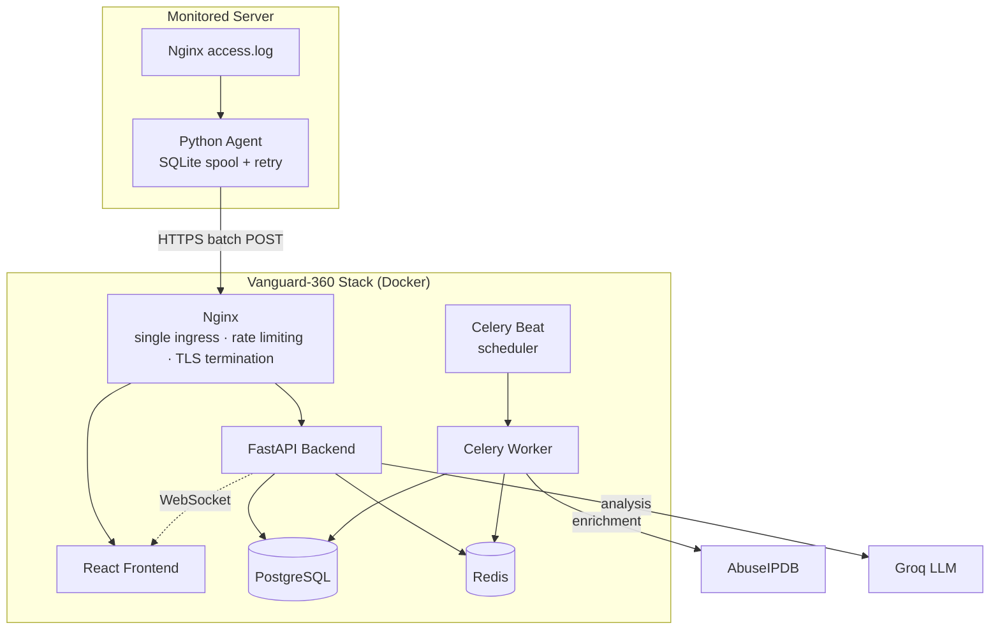

<div align="center">

# 🛡️ Vanguard-360

**Real-time cyber attack monitoring and threat intelligence platform**

Watches live server traffic, classifies threats with a hybrid rule-based + machine-learning engine, and streams every detection to a live world map — with authenticated dashboards, deduplicated alerting, and remote collector fleet management.

[](LICENSE)
[](backend/requirements.txt)
[](https://fastapi.tiangolo.com/)
[](frontend/package.json)
[](docker-compose.yml)

[Quick Start](#-quick-start) · [Architecture](#-architecture) · [API Reference](#-api-reference) · [Deployment](#-deployment)

</div>

---

## 📖 Overview

Vanguard-360 is a self-hosted security operations dashboard for small to mid-sized infrastructure. A lightweight agent tails your server's access logs, ships events to Vanguard's ingestion API, and every request is run through a detection pipeline that combines deterministic attack-signature rules with a behaviorally-trained anomaly detection model — surfacing SQL injection, XSS, path traversal, brute-force, port-scanning, and DDoS activity in real time, with zero reliance on third-party SaaS.

Everything runs in your own Docker environment: PostgreSQL for durable storage, Redis for sliding-window rate tracking and task queuing, Celery for background enrichment and model training, and a single bundled Nginx container as the sole ingress point.

## ✨ Features

**Detection**
- Rule-based signature matching — SQL injection, XSS, path traversal, brute force, scanner/recon tooling, volumetric DDoS
- Behavioral anomaly detection via per-server and per-source IsolationForest models, trained on real traffic windows rather than synthetic data
- Zero-downtime model hot-reload the moment a new model is trained and validated

**Intelligence**
- AbuseIPDB reputation enrichment, cached and rate-limited
- Optional LLM-powered plain-language threat analysis (Groq)
- Geo-located attack sources plotted on a live world map

**Operations**
- Deduplicated, persistent alerting with acknowledge/resolve workflow
- Remote collector fleet management — pause or resume log shipping per server from the dashboard, with heartbeat-based online/offline tracking
- Idempotent ingestion (safe against agent retries and duplicate delivery)
- Scheduled data retention cleanup

**Security**
- Session-based dashboard authentication with HMAC-signed, constant-time-compared tokens
- Rate limiting on login, IP lookups, and AI analysis endpoints
- Refuses to boot in production with default/placeholder secrets
- All API docs disabled outside development

## 🏗️ Architecture



The bundled Nginx container is the **only** externally exposed service — the frontend and backend never accept direct traffic. This keeps the whole stack a single port to reverse-proxy behind your own domain, and makes the frontend and API strictly same-origin (no CORS configuration needed in production).

## 🧰 Tech Stack

| Layer | Technology |
|---|---|
| Backend API | FastAPI, SQLAlchemy (async), Pydantic |
| Database | PostgreSQL 15, Alembic migrations |
| Cache / Queue | Redis, Celery (worker + beat) |
| Machine Learning | scikit-learn (IsolationForest), joblib |
| Frontend | React, Vite, TypeScript |
| Agent | Python, SQLite-backed spool queue |
| Infrastructure | Docker Compose, Nginx |

## 🚀 Quick Start

```bash
git clone https://github.com/sakawatkabir13/real-time-cyber-attack-and-monitoring-map.git vanguard-360
cd vanguard-360
cp .env.example .env
```

Edit `.env` and set at minimum:

```env
POSTGRES_PASSWORD=<generate with: openssl rand -hex 32>
COLLECTOR_TOKEN=<generate with: openssl rand -hex 32>
SECRET_KEY=<generate with: openssl rand -hex 32>
DASHBOARD_PASSWORD=<a strong password>
```

Then bring the stack up:

```bash
docker compose up -d --build
```

The entrypoint runs database migrations automatically. Once healthy:

```bash
curl http://127.0.0.1:8080/api/health
```

Open `http://127.0.0.1:8080` and log in with your `DASHBOARD_PASSWORD`.

To start monitoring a server, install the agent found in [`agent/`](agent/) on the machine you want to watch and point it at your Vanguard instance.

## ⚙️ Configuration

Full reference lives in [`.env.example`](.env.example). Key variables:

| Variable | Purpose |
|---|---|
| `DATABASE_URL` | Async PostgreSQL connection string |
| `REDIS_URL` | Redis connection string |
| `COLLECTOR_TOKEN` | Shared secret agents use to authenticate ingestion |
| `SECRET_KEY` | Signs dashboard session tokens |
| `DASHBOARD_PASSWORD` | Dashboard login credential |
| `CORS_ORIGINS` | Leave empty — frontend and API are same-origin behind the bundled Nginx |
| `ABUSEIPDB_API_KEY` | Enables IP reputation enrichment |
| `GROQ_API_KEY` | Enables AI-powered threat analysis |
| `EVENT_RETENTION_DAYS` | How long threat events are kept before cleanup |
| `ML_MIN_TRAINING_WINDOWS` | Minimum behavioral windows required before a model trains |
| `TARGET_LATITUDE` / `TARGET_LONGITUDE` | Your server's coordinates, used for map arc destinations |

## 📡 API Reference

All endpoints are served under `/api`, behind the bundled Nginx.

| Method | Endpoint | Auth | Description |
|---|---|---|---|
| `POST` | `/api/auth/login` | — | Authenticate and receive a session cookie |
| `POST` | `/api/auth/logout` | Session | End the current session |
| `GET` | `/api/auth/status` | Session | Check current auth state |
| `GET` | `/api/health` | — | Liveness + Redis/PostgreSQL connectivity check |
| `WS` | `/ws` | Session | Real-time threat and alert event stream |
| `POST` | `/api/ingest/batch` | Collector token | Agent log ingestion endpoint |
| `POST` | `/api/collector/heartbeat` | Collector token | Agent heartbeat + desired-state check-in |
| `GET` | `/api/collectors` | Session | List all known collector agents and their status |
| `POST` | `/api/collectors/{server_id}/command` | Session | Pause or resume a collector remotely |
| `GET` | `/api/events` | Session | Recent threat events |
| `GET` | `/api/stats` | Session | Aggregate dashboard statistics (cached) |
| `GET` | `/api/alerts` | Session | List deduplicated alerts, filterable by status |
| `PATCH` | `/api/alerts/{alert_id}/acknowledge` | Session | Acknowledge an alert |
| `GET` | `/api/ip-lookup/{ip}` | Session | Reputation and history for an IP |
| `POST` | `/api/analyze-threat` | Session | LLM-generated plain-language threat summary |
| `POST` | `/api/analyze-log-file` | Session | Upload and analyze a historical log file |
| `GET` | `/api/analysis-status` | Session | Progress of an in-flight log file analysis |
| `GET` | `/api/ml/status` | Session | Current model training/validation status |

## 🔍 Detection Pipeline

Every ingested event is evaluated in order:

1. **Volumetric check** — sliding-window request rate per source IP
2. **Signature rules** — SQL injection, XSS, path traversal, brute force, scanner/recon patterns
3. **Behavioral scoring** — IsolationForest models trained per-server and per-source on real traffic features, only engaged once enough clean data has accumulated (`ML_MIN_TRAINING_WINDOWS`)

Only genuine threats are persisted — normal traffic is evaluated but not stored, keeping dashboard metrics meaningful rather than inflated by routine requests. High and critical severity events are deduplicated into a single alert record with an occurrence counter rather than spamming duplicates.

## 📁 Project Structure

```
vanguard-360/
├── backend/
│   ├── app/
│   │   ├── routers/          # ingest, alerts, collectors, auth
│   │   ├── services/         # detection engine, ML, alerting, geo lookup
│   │   ├── tasks/             # Celery: enrichment, training, cleanup
│   │   └── models/            # SQLAlchemy models
│   ├── alembic/                # database migrations
│   └── tests/
├── frontend/
│   └── src/                    # React application
├── agent/                      # remote log-shipping agent
├── nginx/                      # bundled ingress config
├── docker-compose.yml
└── VPS_DEPLOYMENT_GUIDE.md
```

## 🧪 Testing

```bash
# Backend
cd backend && pytest

# Frontend
cd frontend && npm test
```

## 🌍 Deployment

See [`VPS_DEPLOYMENT_GUIDE.md`](VPS_DEPLOYMENT_GUIDE.md) for a complete production deployment walkthrough, including running Vanguard-360 alongside other applications on a shared host behind a reverse proxy.

## 🗺️ Roadmap

- [ ] Model training on richer historical feature sets
- [ ] Multi-tenant dashboard access control
- [ ] Additional detection rules for application-layer and distributed multi-IP attack patterns

## 🤝 Contributing

Issues and pull requests are welcome. Please open an issue to discuss significant changes before submitting a PR.

## 📄 License

Released under the [MIT License](LICENSE).

## 🙏 Acknowledgments

- [AbuseIPDB](https://www.abuseipdb.com/) — IP reputation data
- [Groq](https://groq.com/) — LLM inference for threat analysis
- Built with FastAPI, React, PostgreSQL, Redis, and Celery
