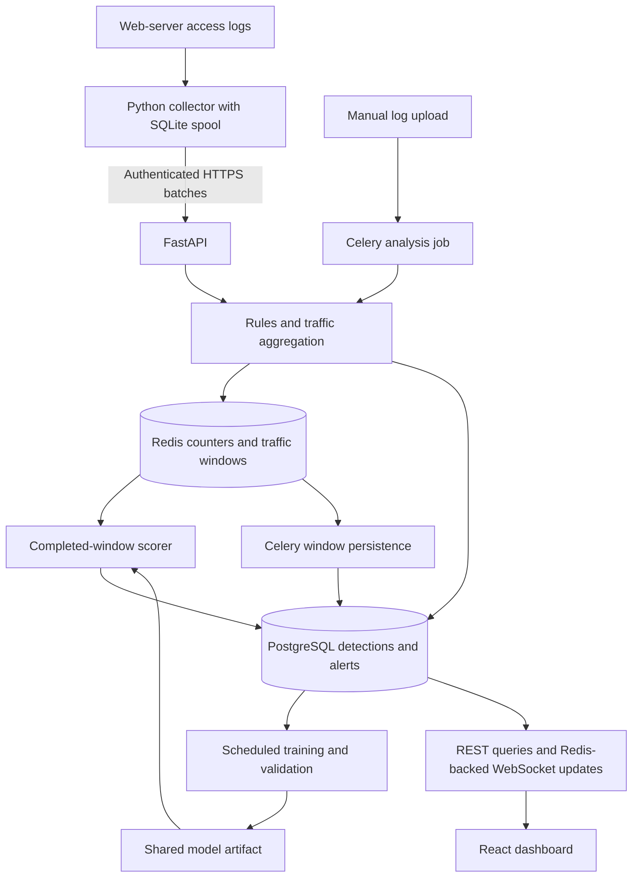

# Vanguard-360

Self-hosted HTTP security monitoring with access-log collection, rule-based detection, behavioral machine learning, and a live investigation dashboard.

[Live dashboard](https://vanguard.cuetinsights.dev) · [Report an issue](https://github.com/sakawatkabir13/Real-time-cyber-attack-monitoring-and-threat-intelligence-platform/issues) · [MIT license](LICENSE)

Vanguard collects web-server access logs and looks for suspicious requests and traffic patterns. Operators can inspect the evidence, review alerts, and track the monitored servers from one dashboard. The current deployment runs on AWS EC2 and monitors `spandan.cuetinsights.dev`.

## What it does

- Detects SQL-injection, XSS, and path-traversal signatures, authentication-failure patterns, HTTP-flood indicators, and scanner activity visible in access logs.
- Aggregates traffic by server and source IP for Isolation Forest anomaly detection.
- Shows detections on a world map with bounded source-to-server animations, request details, and reduced-motion support. Map coordinates are approximate; arcs do not represent measured packet routes.
- Provides time-range and server filters, detection statistics, event feeds, anomaly scores, and connection/pipeline status.
- Stores deduplicated alerts with acknowledgment, resolution, investigation verdicts, and review history. Related-incident groups suggest connections between alerts.
- Manages collector forwarding with remote pause/resume controls and heartbeat-based status.
- Processes manual log uploads through durable Celery jobs with progress and rejected-line counts.
- Supports optional AbuseIPDB reputation lookup, Groq-generated summaries, and local MaxMind geolocation.

Vanguard is a detection and investigation tool. It does not block requests or provide network-level intrusion detection. A TCP SYN scan such as `nmap -sS` does not normally produce an HTTP access-log entry and is outside its detection scope. A detection or anomaly is evidence to investigate, not confirmation of an attack.

## How the pipeline works


```mermaid
flowchart TD
    Logs[Web-server access logs] --> Agent[Python collector with SQLite spool]
    Agent -->|Authenticated HTTPS batches| API[FastAPI]
    Upload[Manual log upload] --> Jobs[Celery analysis job]
    Jobs --> Detection[Rules and traffic aggregation]
    API --> Detection
    Detection --> Redis[(Redis counters and traffic windows)]
    Detection --> DB[(PostgreSQL detections and alerts)]
    Redis --> Scorer[Completed-window scorer]
    Scorer --> DB
    Redis --> Persist[Celery window persistence]
    Persist --> DB
    DB --> Training[Scheduled training and validation]
    Training --> Models[Shared model artifact]
    Models --> Scorer
    DB --> Updates[REST queries and Redis-backed WebSocket updates]
    Updates --> UI[React dashboard]
```

The collector reads new log entries, queues them locally, and sends batches with stable event IDs. Retries can deliver the same batch again without creating duplicate events. Request timestamps drive traffic measurements so a delayed batch is not treated as a sudden burst.

PostgreSQL stores detected events, alerts, reviews, collector state, traffic summaries, and training-run records. Ordinary requests contribute to traffic summaries rather than becoming individual threat records. Redis holds short-lived counters, pending windows, job progress, and the Celery broker/result backend; its pub/sub channel relays live updates between workers and the API.

Celery Beat schedules window persistence, model training, retention cleanup, and pipeline heartbeats. The API runs completed-window scoring and incident grouping, and serves the authenticated dashboard.

## The ML layer

Vanguard trains separate server-level and source-level Isolation Forest models for each monitored server. Features summarize request rates, bursts, path repetition, failures, and measured response behavior. Missing response-duration measurements reduce the information available to the model.

Default training settings are:

| Setting | Default |
| --- | --- |
| Server traffic window | 60 seconds, at least 20 requests |
| Source traffic window | 300 seconds, at least 5 requests |
| Minimum eligible samples | 200 windows for each server/scope model |
| Training history | Most recent 30 days |
| Scheduled training | Daily at 03:30 UTC |

Training excludes rule-flagged and scanner-like windows and applies additional outlier checks. A later portion of the selected history is used to check candidate models before promotion. Compatible model artifacts reload without an API restart.

Until enough eligible traffic exists, the model reports `warming_up`; rules remain active. Low-traffic sites can take time to build a baseline because sparse windows do not qualify. Settings shows candidate counts, exclusion reasons, training runs, model status, and pipeline heartbeats.

The repository includes an independent-label evaluation tool, but detection accuracy and any advantage over rules alone must be measured on a labeled holdout. Training eligibility and internal validation do not establish that traffic is benign or that an alert is correct.

## Components

| Component | Technology and purpose |
| --- | --- |
| Dashboard | React 18, TypeScript, Vite 7, Tailwind CSS, TanStack Query, Zustand, Recharts |
| API | Python 3.11, FastAPI, Pydantic, async SQLAlchemy |
| Persistent storage | PostgreSQL 15 with Alembic migrations |
| Counters, jobs, live relay | Redis 7 |
| Background jobs | Celery worker and Celery Beat |
| Behavioral models | scikit-learn Isolation Forest and joblib |
| Collector | Python agent, SQLite spool, systemd service |
| Deployment | Docker Compose and bundled Nginx ingress; host reverse proxy terminates production TLS |

## Run the application

Install Docker and Docker Compose, then clone the repository:

```bash
git clone https://github.com/sakawatkabir13/Real-time-cyber-attack-monitoring-and-threat-intelligence-platform.git vanguard-360
cd vanguard-360
cp .env.example .env
```

Edit `.env` before starting. Replace `POSTGRES_PASSWORD`, `COLLECTOR_TOKEN`, `SECRET_KEY`, and `DASHBOARD_PASSWORD`. Set the same PostgreSQL password in `DATABASE_URL`; URL-encode it if it contains reserved characters. Generate separate random secrets with `openssl rand -hex 32`.

For a local HTTP session, use:

```dotenv
ENVIRONMENT=development
COOKIE_SECURE=false
BIND_ADDRESS=127.0.0.1
HTTP_PORT=8080
```

For production, keep `ENVIRONMENT=production` and `COOKIE_SECURE=true`, and put an HTTPS reverse proxy in front of the loopback-bound Compose listener. The example defaults to port 80; set `HTTP_PORT` to the port used by your host proxy. Production startup rejects placeholder credentials and insecure cookie settings.

```bash
docker compose up --build -d
docker compose ps
```

The backend applies Alembic migrations before starting. Other services start according to their Compose dependencies. With the local settings above, open `http://localhost:8080` and sign in using `DASHBOARD_PASSWORD`.

Full configuration defaults are in [`.env.example`](.env.example). Leave `CORS_ORIGINS=[]` for a same-origin frontend/API deployment. Optional API keys can remain empty. Set `TARGET_LATITUDE` and `TARGET_LONGITUDE` to the monitored server's approximate location for map destinations. MaxMind support requires a separately configured account/license; otherwise geolocation can use the external fallback.

## Connect a monitored server

The collector must run on the machine that can read the website's access log. Configure its environment before installation:

```bash
cd agent
cp .env.example .env
```

Edit `agent/.env` with the HTTPS `BACKEND_URL`, matching `COLLECTOR_TOKEN`, a stable `SERVER_ID`, and the correct `LOG_PATH`. Use a dedicated site log when monitoring one site on a shared VPS. JSON logs with original client IP, timezone-aware timestamp, method, path, status, bytes, duration, and user agent provide the most useful measurements.

```bash
sudo ./install.sh
sudo systemctl status vanguard-agent
sudo journalctl -u vanguard-agent -f
```

The installer copies the agent and its private `.env` into `/opt/vanguard-agent` and registers the systemd service. Its SQLite spool lives under `/var/lib/vanguard-agent`. By default, it starts at the end of an existing log and forwards new entries.

Collector pause stops forwarding; it does not stop the website. The map's pause control only pauses visualization animations.

## Operations and testing

```bash
# Inspect services and recent logs
docker compose ps
docker compose logs --tail=100 backend celery_worker celery_beat

# Stop the stack while keeping persistent volumes
docker compose down
```

`GET /api/health` reports database/Redis connectivity and background-loop, Celery, collector, and model status. Background diagnostic failures do not all change the HTTP status, so monitoring should check the JSON fields as well. Authenticated model diagnostics are available at `GET /api/ml/status` and in Settings.

GitHub Actions runs tests, frontend lint/build, dependency checks, Docker builds, and secret scanning. Production deployment is manually triggered. The external health-monitor workflow supports email alerts when its variables and SMTP secret are configured.

For local development checks:

```bash
# Backend: use an activated Python 3.11 virtual environment, from backend/
pip install -r requirements-dev.txt
python -m pytest -q tests

# Collector and monitor tests, from the repository root
pip install -r agent/requirements.txt
python -m pytest -q agent/test_agent.py ops/test_monitor.py

# Frontend, from frontend/
npm ci
npm test
npm run lint
npm run build
```

The PostgreSQL integration test requires a dedicated disposable database through `VANGUARD_TEST_DATABASE_URL`; do not point it at production. CI supplies a temporary PostgreSQL service.

## Repository layout

```text
backend/       FastAPI, detection/ML services, Celery tasks, migrations, tests
frontend/      React pages, dashboard components, data hooks, frontend tests
agent/         Collector, installer, systemd unit, tests
nginx/         Bundled ingress configuration
ops/           External health monitor and tests
.github/       CI, manual deployment, health-monitor workflows
```

Detailed guides and deep-dive documents are maintained privately and excluded from the repository.

## Security and license

Monitor only systems you own or have permission to monitor. Dashboard sessions and collector requests use separate credentials; keep `.env`, API keys, and tokens out of Git. Restrict access to stored logs and IP-address data. Report vulnerabilities privately to the maintainer rather than including credentials or exploit details in a public issue.

Vanguard-360 is licensed under the [MIT license](LICENSE).
