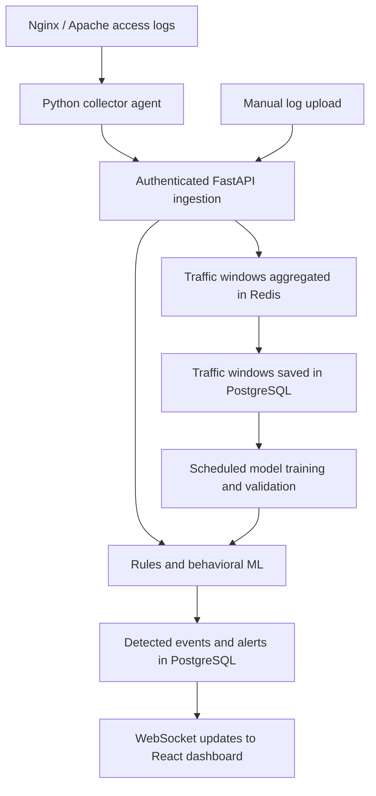
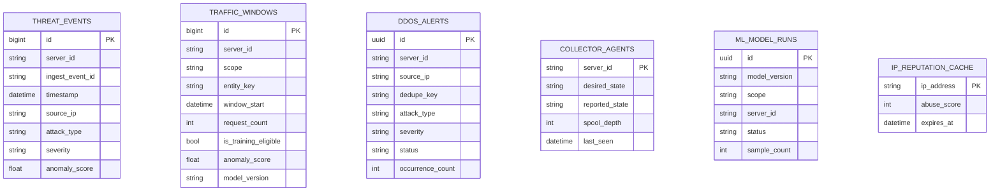

# Vanguard-360 — Current Codebase Comprehensive Technical Lecture


**Vanguard-360**, is a self-hosted platform that collects web-server access logs, identifies suspicious activity using rules and machine learning, and displays detections on a live security dashboard.

It monitors the servers connected to it. The world map shows the approximate locations of their detected source IPs—not attacks happening everywhere on the internet.

Here is the complete picture based on the current code.

**How data moves through the system**



**1. The main components**

| Component | Its responsibility |
|---|---|
| React + TypeScript frontend | Dashboard, map, charts, alerts, IP lookup, uploads, and collector controls |
| FastAPI backend | Authentication, log parsing, detection, database access, and live updates |
| Python collector | Reads access logs on each monitored server and delivers batches |
| PostgreSQL | Stores detections, alerts, traffic summaries, collector state, and training history |
| Redis | Request counters, traffic aggregation, cached reputation, duplicate tracking, and Celery queues |
| Celery worker + Beat | Background enrichment, scheduled training, traffic-window persistence, and cleanup |
| Nginx + Docker Compose | Routes browser/API traffic and runs the services together |

The frontend uses Tailwind/shadcn components, Recharts for charts, React Simple Maps for geography, and Zustand for browser state.

**2. How the collector works**

You install the [agent](/home/tomriddle/agents/DDos/real-time-cyber-attack-and-monitoring-map/agent/agent.py) on a server and configure its log path, backend URL, server ID, and collector token.

It reads new log lines, accepts JSON or standard access-log text, assigns event IDs, and stores pending events in a local SQLite queue. It sends batches to `/api/ingest/batch` and retries failed deliveries with increasing delays. Saved file positions help it resume after restarts, and it handles log rotation.

Heartbeats report whether the agent is running, its queue depth, and delivery errors. Dashboard commands change its desired forwarding state.

**Pausing stops transmission while local collection continues until the queue limit is reached.** It does not stop the monitored website. Resuming sends the queued records.

**3. What the detection rules do**

The backend parses fields such as source IP, timestamp, HTTP method, path, response status, bytes, and user agent. The current [detection engine](/home/tomriddle/agents/DDos/real-time-cyber-attack-and-monitoring-map/backend/app/services/detection_engine.py) checks:

| Classification | Current trigger |
|---|---|
| DDoS | More than 100 processed requests from one IP to one server within five minutes |
| SQL injection | Recognized SQL-like patterns in the URL |
| XSS | Script-related patterns in the URL |
| Path traversal | Directory-escape sequences or sensitive filesystem paths |
| Brute force | More than 15 failed authentication requests with HTTP 401/403 within five minutes |
| Scanner/reconnaissance | Recognized tool user agents or commonly probed paths |

These are heuristics: they identify suspicious indicators, not proof that an attack succeeded. For example, legitimate `curl` requests can match the scanner rule, and 100 requests in five minutes can be ordinary activity.

Normal requests contribute to traffic summaries but do not create individual `ThreatEvent` records. Detected requests receive a classification, severity, score, and explanation.

**4. What your ML actually does**

The ML answers: **“Does this traffic behave unusually compared with this server’s learned baseline?”**

It uses scikit-learn’s **Isolation Forest**, an unsupervised anomaly-detection algorithm. You do not need to label every training request as an attack or normal.

For each server, it builds two models:

- **Server model:** examines all traffic together in default 60-second windows. It can identify unusual aggregate behavior even when no individual IP crosses a rule threshold.
- **Source-behavior model:** examines individual IP activity in default five-minute windows. It learns from source windows belonging to that server; it does not train a separate model for every IP.

Features include request rate, IP diversity, newly seen sources, path diversity and concentration, HTTP error ratios, average response size and duration, user-agent diversity, reputation information, and time-of-day/day-of-week patterns.

The [training task](/home/tomriddle/agents/DDos/real-time-cyber-attack-and-monitoring-map/backend/app/tasks/train_model.py):

1. Reads real traffic windows from PostgreSQL.
2. Excludes windows with rule detections or recorded high ML scores and filters extreme samples.
3. Requires at least **200 eligible windows per server, per model scope** by default.
4. Trains using the earlier 80% and validates against the later 20%.
5. Rejects unsuitable candidates and retains previous models.
6. Saves accepted models to a shared file that the backend reloads automatically.

Training is scheduled daily at **03:30 UTC**. Until a server has a usable model, rules remain active while ML warms up.

During ingestion, new records trigger scoring of preceding windows. Scores above the default **90/100** threshold can produce `server_traffic_anomaly` or `source_behavior_anomaly` detections, with explanations of features that differ from the baseline.

**A score of 95 is not a 95% probability of attack.** Also, rule detections use fixed scores in the same dashboard field, so the score chart is not exclusively ML output.

**5. Events, alerts, and storage**

An **event** is an individual detection. An **alert** groups related detections into an incident that an operator can acknowledge.

High/critical events and ML anomalies create persistent alerts. Related detections are grouped into default 15-minute buckets, increasing their occurrence count. The API currently supports acknowledgement; although the schema includes `resolved`, a complete resolve action is not implemented.

PostgreSQL’s main active tables hold:

- `threat_events`: detected requests and explanations.
- `traffic_windows`: aggregated traffic used for ML.
- `ddos_alerts`: persistent incidents.
- `collector_agents`: heartbeat and forwarding state.
- `ml_model_runs`: training results and rejection reasons.

Traffic windows are persisted every minute. Daily cleanup removes events, windows, and alerts older than the default 30-day retention period.

**6. What the dashboard provides**

The dashboard shows detection counts, critical alerts, unique source IPs, recent activity, hourly charts, attack categories, scores, and the map. New events arrive through authenticated WebSockets; statistics refresh periodically.

Other pages provide IP investigation, historical log upload with progress, persistent alerts, and settings for theme, feed refresh, alert filtering, and ML status. The alert-sensitivity setting filters displayed incidents—it does not retrain the model or change backend detection thresholds.

**7. External services and security**

AbuseIPDB optionally supplies cached IP reputation. Geolocation uses a configured local MaxMind database or falls back to GeoJS.

Groq optionally generates readable summaries from stored detections and reputation data. **Groq is separate from your Isolation Forest pipeline** and does not train or run the behavioral models. Cloudflare Radar is not currently a detection input, so its API is not required for this pipeline.

Dashboard access uses a shared password and signed session cookie. Production startup requires configured secrets and secure cookies. Collector traffic uses a separate shared bearer token. The application also has endpoint rate limits, upload limits, authenticated WebSockets, and database migrations.

**8. Its practical boundaries**

This is an HTTP-log monitoring system. It cannot observe all network-layer floods, inspect request bodies absent from logs, automatically block attackers, or protect a saturated internet connection.

Detection quality depends on the logs: standard text parsing currently supplies no real request-duration measurement, and volume rules count processing time, which can distort historical uploads or delayed batches.

The repository includes tests, a simulated-log generator, and an ML evaluation script. That evaluator compares ML results against rule detections; it does not establish accuracy against independently verified attack labels. VPS capacity controls, stronger collector isolation, proxy configuration, and load/recovery testing remain relevant to the production-readiness concerns discussed earlier.


> **Source of truth for this lecture:** the uploaded `vanguard-360_latest.zip` codebase.  
> **Purpose:** explain what the system does now, how every major subsystem works, how data moves through it, how the behavioral ML model is trained and used, and which files are active versus legacy/unwired.

---

## Table of Contents

1. [The One-Sentence Mental Model](#1-the-one-sentence-mental-model)
2. [What Changed Most From the Older Architecture](#2-what-changed-most-from-the-older-architecture)
3. [Repository Map](#3-repository-map)
4. [Runtime Architecture and Docker Topology](#4-runtime-architecture-and-docker-topology)
5. [The Remote Collector Agent](#5-the-remote-collector-agent)
6. [Ingress, Authentication, and Security Boundaries](#6-ingress-authentication-and-security-boundaries)
7. [Ingestion: Parsing, Idempotency, and Delivery Semantics](#7-ingestion-parsing-idempotency-and-delivery-semantics)
8. [Detection Engine: Rule Layer + Behavioral Layer](#8-detection-engine-rule-layer--behavioral-layer)
9. [Behavioral Feature Engineering](#9-behavioral-feature-engineering)
10. [Machine Learning Model: What It Really Learns](#10-machine-learning-model-what-it-really-learns)
11. [ML Training Pipeline](#11-ml-training-pipeline)
12. [ML Inference and Online Scoring](#12-ml-inference-and-online-scoring)
13. [PostgreSQL: Permanent/Queryable State](#13-postgresql-permanentqueryable-state)
14. [Redis: Fast Operational State](#14-redis-fast-operational-state)
15. [Celery: Scheduled and Background Work](#15-celery-scheduled-and-background-work)
16. [Threat Persistence, Geolocation, Alerts, and WebSockets](#16-threat-persistence-geolocation-alerts-and-websockets)
17. [Backend API](#17-backend-api)
18. [Frontend Architecture](#18-frontend-architecture)
19. [Page-by-Page Frontend Behavior](#19-page-by-page-frontend-behavior)
20. [AbuseIPDB and Groq AI](#20-abuseipdb-and-groq-ai)
21. [Historical Log Analyzer](#21-historical-log-analyzer)
22. [Alembic, Startup, Deployment, and Persistence](#22-alembic-startup-deployment-and-persistence)
23. [Exact Timers, TTLs, Limits, and Thresholds](#23-exact-timers-ttls-limits-and-thresholds)
24. [End-to-End Trace: Normal Request](#24-end-to-end-trace-normal-request)
25. [End-to-End Trace: SQL Injection](#25-end-to-end-trace-sql-injection)
26. [End-to-End Trace: Behavioral ML Anomaly](#26-end-to-end-trace-behavioral-ml-anomaly)
27. [End-to-End Trace: Model Training](#27-end-to-end-trace-model-training)
28. [Collector Pause/Resume State Machine](#28-collector-pauseresume-state-machine)
29. [What Is Present but Not Actively Wired](#29-what-is-present-but-not-actively-wired)
30. [Important Implementation Nuances and Limitations](#30-important-implementation-nuances-and-limitations)
31. [How to Think About Vanguard-360 as a Whole](#31-how-to-think-about-vanguard-360-as-a-whole)
32. [Recommended Study Order](#32-recommended-study-order)
33. [Quick Oral-Exam Questions](#33-quick-oral-exam-questions)

---

# 1. The One-Sentence Mental Model

**Vanguard-360 is a self-hosted web-traffic security monitoring system that collects HTTP access logs from remote servers, detects known attacks with deterministic rules, learns each server’s normal traffic behavior with unsupervised Isolation Forest models, persists threats/incidents and behavioral windows, and streams live security events to an authenticated React dashboard.**

The most important conceptual separation is this:

```text
RAW HTTP ACCESS LOGS
        |
        v
Remote Collector Agent
        |
        v
Authenticated / Idempotent Ingestion
        |
        +-------------------------------+
        |                               |
        v                               v
Rule Detection                    Behavioral Aggregation
(SQLi, XSS, DDoS...)              (server + source windows)
        |                               |
        |                               v
        |                         IsolationForest scoring
        |                               |
        +---------------+---------------+
                        |
                        v
                  Threat Event
                        |
          +-------------+-------------+
          |             |             |
          v             v             v
     PostgreSQL     Alert layer   WebSocket
                                      |
                                      v
                                React dashboard
```

A crucial point: **normal raw requests are not saved as `threat_events`.** They still matter, because they are aggregated into behavioral traffic windows used for ML training. In other words, the system keeps detailed rows for threats but compressed statistical summaries for ordinary traffic.

---

# 2. What Changed Most From the Older Architecture

The current code is not just a small revision of the older implementation. The architecture changed in several fundamental ways.

## 2.1 The ML model no longer trains from `threat_events`

The old design described a five-feature per-request Isolation Forest using values such as reputation score, request volume, reporters, community reports, and Cloudflare traffic share.

The current design instead builds **completed behavioral windows from all traffic**, then trains **two 14-feature models per monitored server**:

- a **server-scope model**, learning overall server traffic behavior;
- a **source-scope model**, learning the distribution of individual source-IP behaviors seen by that server.

This is the single biggest architectural change.

## 2.2 Cloudflare Radar is no longer part of the active system

There is no current Cloudflare polling Celery task and no Cloudflare feature in the current ML feature vectors.

The active scheduled Celery jobs are now:

- persist completed traffic windows every minute;
- train behavioral models daily;
- clean old database records daily.

AbuseIPDB enrichment remains.

## 2.3 The agent is now durable

The old mental model of “read lines into an in-memory batch and retry” is obsolete.

The current agent has a local SQLite database containing:

- a persistent outbound queue;
- file cursor/inode state;
- agent command state.

That gives the collector **at-least-once delivery semantics** and crash/restart recovery.

## 2.4 Ingestion is explicitly idempotent

Each collected event receives a stable `event_id`.

The backend deduplicates in two layers:

1. Redis claim/done state for fast retry handling;
2. a PostgreSQL unique constraint on `(server_id, ingest_event_id)`.

This allows the agent to retry without duplicating threat rows.

## 2.5 Collector control is real now

The dashboard can pause/resume forwarding per collector.

Each agent heartbeats to the backend and receives:

- `desiredState`
- `commandVersion`

The backend stores collector state in PostgreSQL.

## 2.6 Alerts are persistent backend incidents

The frontend is no longer merely inventing alert notifications from local state.

The backend creates/de-duplicates persistent alert records (`ddos_alerts`, despite the legacy table name), and those alert records can be acknowledged.

## 2.7 Database schema management moved to Alembic

The backend no longer creates the complete application schema in FastAPI startup with `Base.metadata.create_all()`.

The backend container entrypoint runs:

```bash
alembic upgrade head
```

before the API process starts.

## 2.8 The backend currently runs one Uvicorn worker

Current Compose:

```text
uvicorn app.main:app --host 0.0.0.0 --port 8000 --workers 1
```

That is meaningful because the WebSocket connection manager and historical-analysis status are process-local in-memory objects.

---

# 3. Repository Map

At a high level:

```text
vanguard-360/
├── agent/
│   ├── agent.py
│   ├── install.sh
│   ├── vanguard-agent.service
│   ├── requirements.txt
│   └── test_agent.py
│
├── backend/
│   ├── app/
│   │   ├── main.py
│   │   ├── config.py
│   │   ├── database.py
│   │   ├── security.py
│   │   ├── redis_client.py
│   │   ├── websocket_manager.py
│   │   ├── models/
│   │   ├── schemas/
│   │   ├── routers/
│   │   ├── services/
│   │   └── tasks/
│   ├── alembic/
│   ├── evaluate_model.py
│   ├── generate_ddos_log.py
│   ├── tests/
│   ├── Dockerfile
│   └── entrypoint.sh
│
├── frontend/
│   ├── src/
│   │   ├── components/
│   │   ├── pages/
│   │   ├── hooks/
│   │   ├── store/
│   │   ├── App.tsx
│   │   └── main.tsx
│   ├── Dockerfile
│   ├── nginx-spa.conf
│   └── package.json
│
├── nginx/
│   └── nginx.conf
│
├── docker-compose.yml
├── .env.example
├── README.md
└── deployment guides...
```

## Backend responsibilities by file

| File | Main responsibility |
|---|---|
| `app/main.py` | FastAPI app, auth endpoints, events/stats, ML status, IP lookup, AI analysis, log upload, WebSocket |
| `app/security.py` | Dashboard session cookie, password validation, collector token auth |
| `app/redis_client.py` | Async Redis connection, sliding windows, rate limiting, ingestion idempotency |
| `routers/ingest.py` | Parse collector events and run detection |
| `routers/collectors.py` | Agent heartbeat and pause/resume commands |
| `routers/alerts.py` | Read/acknowledge persistent alerts |
| `services/detection_engine.py` | Deterministic rule detection + handoff to behavioral ML |
| `services/behavioral_features.py` | Build Redis traffic windows and score completed windows |
| `services/ml_features.py` | Defines feature vectors, transforms, temporal encoding, score calibration |
| `services/ml_engine.py` | Loads model bundle, hot reloads, performs inference/explanations |
| `services/event_pipeline.py` | Geo-enrich, persist threats, create alerts, broadcast WebSocket messages |
| `services/alert_service.py` | Alert creation/de-duplication logic |
| `services/geo_lookup.py` | MaxMind or GeoJS lookup |
| `services/abuseipdb.py` | Detailed dashboard AbuseIPDB lookup |
| `tasks/enrich_ips.py` | Background AbuseIPDB detection enrichment |
| `tasks/flush_traffic_windows.py` | Redis behavioral windows → PostgreSQL |
| `tasks/train_model.py` | Behavioral model training/validation/promotion |
| `tasks/cleanup_events.py` | Retention cleanup |
| `tasks/celery_app.py` | Celery configuration and schedule |

---

# 4. Runtime Architecture and Docker Topology

Current `docker-compose.yml` starts seven services:

```text
                         Internet / Host Reverse Proxy
                                   |
                                   v
                              +---------+
                              |  nginx  |  <-- only published container port
                              +----+----+
                                   |
                    +--------------+--------------+
                    |                             |
                    v                             v
             +-------------+              +-------------+
             |  frontend   |              |   backend   |
             | Nginx+React |              |   FastAPI   |
             +-------------+              +------+------+ 
                                                |
                              +-----------------+-----------------+
                              |                                   |
                              v                                   v
                        +------------+                       +-----------+
                        | PostgreSQL |                       |   Redis   |
                        +------------+                       +-----+-----+
                                                                  |
                                                   +--------------+--------------+
                                                   |                             |
                                                   v                             v
                                            +--------------+              +-------------+
                                            | celery_worker|              | celery_beat |
                                            +--------------+              +-------------+
```

## Service-by-service

### `postgres`

- PostgreSQL 15 Alpine.
- Persistent named volume: `postgres_data`.
- Stores durable application records.
- Healthchecked with `pg_isready`.

### `redis`

- Redis 7 Alpine.
- Started with `--appendonly yes`.
- Persistent named volume: `redis_data`.
- Used for:
  - request sliding windows;
  - API rate limiting;
  - ingestion idempotency state;
  - behavioral feature aggregation;
  - AbuseIPDB caches;
  - dashboard stats cache;
  - Celery broker/results;
  - ML training lock.

Redis is operationally “fast state,” not the long-term analytics source of truth, even though AOF and a volume make it restart-persistent.

### `backend`

- Python 3.11.
- FastAPI + Uvicorn.
- One Uvicorn worker.
- Shared model volume mounted at `/models`.
- Runs Alembic migrations before process startup because `RUN_MIGRATIONS=1`.

### `celery_worker`

- Same backend image.
- Runs four Celery worker processes/concurrency slots.
- Shares `/models` with the backend.
- Therefore the worker can train a model artifact that the API later hot-reloads.

### `celery_beat`

- Scheduler only.
- Persists schedule state under `/var/lib/celery`.
- Pushes due tasks to Redis.
- Does not itself perform training or cleanup.

### `frontend`

- Build stage uses Node 20.
- Produces static React/Vite files.
- Runtime image is Nginx serving `dist/`.

### top-level `nginx`

- The only Compose service bound to the host.
- Routes `/` to frontend.
- Routes `/api/` to backend.
- Routes `/ws` to backend with WebSocket upgrade.
- Adds security headers and request/connection limiting.

## Named volumes

```text
postgres_data      -> PostgreSQL data
redis_data         -> Redis AOF/data
model_data         -> behavioral_models.joblib
celery_beat_data   -> Beat scheduler state
```

---

# 5. The Remote Collector Agent

**File:** `agent/agent.py`

The agent is much more important than it looks. It is effectively a small durable log-shipping system.

## 5.1 What the agent watches

Default:

```text
/var/log/nginx/access.log
```

The agent uses two mechanisms simultaneously:

1. `watchdog` filesystem notifications for modifications/creation;
2. a fallback loop calling `read_new_lines()` approximately every second.

This helps it continue working even if a filesystem event is missed.

## 5.2 The local SQLite spool

Default:

```text
/var/lib/vanguard-agent/spool.db
```

It creates three SQLite tables.

### `queue`

```text
id          stable event UUID
payload     serialized JSON event
created_at  enqueue timestamp
```

This is the outbound delivery queue.

### `cursors`

```text
path
inode
offset
```

This remembers exactly how far the agent has consumed the access log.

### `agent_state`

Stores values such as:

```text
desired_state
command_version
```

so a restart does not forget the most recent remote command.

## 5.3 The most important durability transaction

For each new log line, the agent:

1. parses/wraps the line;
2. generates `event_id = uuid.uuid4().hex`;
3. begins a SQLite transaction;
4. inserts the payload into `queue`;
5. updates the file cursor;
6. commits.

Conceptually:

```text
BEGIN
    INSERT outbound_event
    UPDATE file_cursor
COMMIT
```

This ordering matters.

If the process crashes after commit, the line is already safely queued.

If it crashes before commit, the cursor should not be durably advanced beyond an unqueued line.

That is the core crash-safety property.

## 5.4 Input formats

The agent first attempts:

```python
json.loads(line)
```

If the line is valid JSON and is a dictionary, it preserves the fields.

Otherwise it sends:

```json
{
  "raw_log": "...original line...",
  "type": "combined_log"
}
```

Then it adds:

```json
"event_id": "<stable UUID>"
```

Using structured JSON Nginx logs gives the backend richer information such as request time and host. Standard combined logs are supported but have fewer fields.

## 5.5 Log rotation handling

The agent tracks the inode.

If the active path’s inode changes:

1. it tries to drain unread lines from the old open file;
2. then it opens the newly created file from offset `0`.

If the file shrinks but the inode stays the same, it treats that as truncation and seeks to `0`.

## 5.6 Spool pressure

Default maximum:

```text
MAX_SPOOL_EVENTS = 100000
```

When the SQLite queue reaches that size, the agent stops consuming additional log lines until delivery recovers.

This is deliberate backpressure: do not endlessly grow disk usage.

## 5.7 Delivery loop

The sender thread reads up to:

```text
BATCH_SIZE = 100
```

oldest queued events and POSTs:

```http
POST /api/ingest/batch
Authorization: Bearer <COLLECTOR_TOKEN>
Content-Type: application/json
```

with:

```json
{
  "server_id": "server_01",
  "events": [...]
}
```

Important: `BATCH_SIZE` is a **maximum**, not a “wait until 100” threshold. If only a few rows are queued, the sender can send that smaller batch.

## 5.8 Retry semantics

On success:

```text
delete delivered event IDs from SQLite queue
```

On failure:

```text
keep them in SQLite
retry later
```

The retry delay exponentially backs off up to 300 seconds.

Because the backend is idempotent, the system can safely prefer re-sending over risking data loss.

That is classic **at-least-once delivery + receiver deduplication**.

## 5.9 Heartbeat and remote control

Every default 10 seconds:

```http
POST /api/collector/heartbeat
```

Agent sends:

```json
{
  "server_id": "...",
  "reported_state": "running|paused",
  "spool_depth": 123,
  "agent_version": "2.0.0",
  "last_error": "..."
}
```

Backend replies:

```json
{
  "desiredState": "running|paused",
  "commandVersion": 7
}
```

The agent persists that desired state locally.

### What “pause” actually means

In the current code, pause stops the **sender loop from forwarding queued events**.

The main file-reading loop still continues to read and spool new log lines.

So:

```text
PAUSED != stop monitoring the file

PAUSED == keep collecting locally, stop forwarding to Vanguard
```

That is why the UI can show something like:

```text
PAUSED · 438 QUEUED
```

When resumed, the backlog is sent.

---

# 6. Ingress, Authentication, and Security Boundaries

There are two completely separate authentication concepts.

## 6.1 Collector authentication

Collector endpoints use:

```http
Authorization: Bearer <COLLECTOR_TOKEN>
```

The token is compared with `hmac.compare_digest()`.

Protected collector routes:

- `/api/ingest/batch`
- `/api/collector/heartbeat`

## 6.2 Dashboard authentication

The dashboard uses a single configured password:

```text
DASHBOARD_PASSWORD
```

Login:

```http
POST /api/auth/login
```

On success, the server creates a cookie:

```text
vanguard_session=<expiry>.<HMAC signature>
```

The token is stateless.

Pseudo-format:

```text
expires_at = UNIX_NOW + SESSION_TTL
signature  = HMAC_SHA256(SECRET_KEY, expires_at)
token      = expires_at + "." + signature
```

Validation checks:

1. token exists;
2. expiry is numeric;
3. expiry is still in the future;
4. HMAC matches in constant time.

Cookie settings:

```text
HttpOnly
SameSite=Strict
Secure=<COOKIE_SECURE>
Path=/
Max-Age=<session TTL>
```

Default session TTL is 43,200 seconds = 12 hours.

This is **not** a user database, JWT identity system, RBAC system, or OAuth flow. It is a shared dashboard password with a signed session cookie.

## 6.3 Production secret safety

In production, startup refuses obvious insecure defaults for:

- collector token;
- dashboard password;
- secret key;
- secure-cookie setting.

## 6.4 App-level rate limiting

Redis sliding windows rate-limit:

- login attempts;
- IP lookups;
- Groq AI analyses;
- collector heartbeats.

Examples:

```text
login        10 / 5 minutes / client
IP lookup    30 / minute / client
AI analysis   5 / minute / client
heartbeat    30 / minute / server
```

## 6.5 Nginx-level limits

The outer Nginx adds another layer:

```text
API rate zone: 20 requests/sec/client
WebSocket: max 5 connections/client IP
```

and security headers including:

- `X-Content-Type-Options: nosniff`
- `X-Frame-Options: DENY`
- `Referrer-Policy: no-referrer`
- restrictive `Permissions-Policy`

## 6.6 WebSocket authentication

The browser’s WebSocket handshake carries the session cookie automatically.

The backend rejects unauthenticated sockets with code `4401`.

There is also an application-wide configurable maximum number of active WebSocket connections.

---

# 7. Ingestion: Parsing, Idempotency, and Delivery Semantics

**File:** `backend/app/routers/ingest.py`

The ingestion route returns HTTP `202 Accepted`.

## 7.1 Batch validation

A batch contains:

```text
server_id: 1–64 characters
events:    1..MAX_INGEST_BATCH_SIZE dictionaries
```

Default backend maximum:

```text
250 events per batch
```

The agent default is 100, so it stays below this limit.

## 7.2 Per-event size guard

Before parsing, an event’s serialized representation must be no more than 16 KB.

Oversized events are rejected.

## 7.3 Raw combined-log parser

For a standard line such as:

```text
203.0.113.8 - - [17/Aug/2026:13:20:10 +0000] "GET /login HTTP/1.1" 401 531 "-" "Mozilla/5.0"
```

the regex extracts:

- source IP;
- timestamp;
- method;
- path/query;
- status;
- bytes;
- user-agent.

For raw combined logs, the backend fills:

```text
request_time = 0.0
host         = "unknown"
```

Therefore, if you use ordinary combined logs, `avg_request_time` is effectively not informative for those events. Structured JSON logs can populate it.

## 7.4 Structured event parser

If the agent parsed a JSON dictionary, the backend accepts fields like:

```text
source_ip or ip
timestamp
method
path
status_code
bytes_sent
request_time
user_agent
host
```

This is the richer ingestion mode.

## 7.5 Event ID validation

`event_id`, when present, must match:

```text
[A-Za-z0-9._:-]{1,64}
```

## 7.6 Redis idempotency claim

Before processing an event ID:

```text
ingest:event:<hash(server_id)>:<hash(event_id)>
```

is atomically claimed with `SET NX`.

States:

```text
missing      -> claim as "processing"
processing   -> another copy is currently in flight
done         -> already successfully handled
```

`processing` claim TTL: 10 minutes.

Completed state TTL: 7 days.

## 7.7 Duplicate cases

Duplicates can be suppressed when:

- the same event ID appears twice within one batch;
- Redis says the event is already `done`;
- PostgreSQL already contains the `(server_id, ingest_event_id)` pair.

## 7.8 Database-level idempotency

`threat_events` has:

```text
UNIQUE(server_id, ingest_event_id)
```

This is important because Redis alone should not be the only protection.

## 7.9 Processing each valid log entry

For each parsed entry:

```python
detected = await detection_engine.process_log(log_entry)
```

If `detected is None`:

- the raw request is considered non-threat;
- no `threat_events` row is created;
- but behavioral aggregation has already seen the request.

If a threat is returned:

```text
PendingThreat(threat, event_id)
```

is collected for batch persistence.

## 7.10 Batch persistence

All detected threats from the batch are passed to:

```python
persist_threats(db, threats)
```

After persistence succeeds, the backend marks event IDs done in Redis.

If an exception occurs, processing claims are released so the sender can retry.

## 7.11 Delivery guarantee in plain English

The combined agent/backend behavior is:

```text
agent queues durably
        +
agent retries
        +
stable event IDs
        +
Redis duplicate suppression
        +
database unique constraint
        =
practical at-least-once delivery without duplicate threat rows
```

---

# 8. Detection Engine: Rule Layer + Behavioral Layer

**File:** `backend/app/services/detection_engine.py`

For every parsed request:

```text
1. update per-source request-rate counter
2. get IP-reputation cache or queue enrichment
3. run deterministic attack rules
4. update server behavioral window
5. update source behavioral window
6. score previous completed windows when possible
7. return rule threat first; otherwise ML finding; otherwise None
```

## 8.1 Request-volume counter

Per server + per IP:

```text
5-minute true sliding window
```

The Redis key is hashed and scoped, so identical source IPs on two monitored servers do not share the same rule counter.

## 8.2 Detection enrichment

The engine checks:

```text
ip_data:<raw source IP>
```

in Redis.

When missing:

- default reputation features are zero for this request;
- `enrich_ip_task.delay(ip)` is queued.

The next appearances of that IP can benefit from enriched reputation values.

## 8.3 Rule order

Current rule order is:

```text
1. DDoS
2. SQL injection
3. XSS
4. Path traversal
5. Brute force
6. Scanner/recon
```

The **first matching rule wins**.

That means a high-volume SQL injection request that crosses the DDoS threshold is classified as DDoS in the current code, because DDoS is checked first.

## 8.4 DDoS rule

```text
request_volume > 100 within last 5 minutes
```

from one IP on one monitored server.

Result:

```text
attack_type   = ddos
severity      = critical
anomaly_score = 95.0   (fixed rule score, not an ML prediction)
```

This is a **single-source volumetric rule**, not a distributed multi-IP DDoS detector.

The server-scope behavioral model can potentially notice distributed traffic anomalies, but that is a different detection mechanism.

## 8.5 SQL injection rule

Regex patterns include concepts such as:

- `UNION SELECT`
- `SELECT ... FROM`
- `DROP TABLE`
- boolean quote tricks
- SQL comments
- `SLEEP()`
- `BENCHMARK()`
- `WAITFOR DELAY`
- hexadecimal payload fragments.

Result:

```text
severity      = high
anomaly_score = 90.0 fixed
```

## 8.6 XSS rule

Looks for patterns such as:

- `<script>`
- `javascript:`
- event handlers like `onerror=`
- iframe/img injection
- `document.cookie`
- `eval(`
- `alert(`.

Fixed score: 85.

## 8.7 Path traversal

Looks for:

- `../`
- encoded traversal;
- `/etc/passwd`;
- `/etc/shadow`;
- `/root/.ssh`;
- Windows `system32`;
- similar sensitive paths.

Fixed score: 88.

## 8.8 Brute force

Three ideas are combined:

1. request path looks like authentication;
2. response is `401` or `403`;
3. **failed-auth counter**, not general request counter, crosses 15 in five minutes.

Each failed auth request gets its own Redis sliding-window update under a different scope.

Rule fires when:

```text
failed_auth_attempts > 15
```

Fixed score: 82.

## 8.9 Scanner/recon

Detected by either:

- scanner-like user agent;
- sensitive probe path.

Examples in the regex include:

```text
sqlmap
nikto
nmap
masscan
nuclei
gobuster
ffuf
curl
wget
python-requests
.env
.git/config
wp-login.php
phpmyadmin
backup files
```

Fixed score: 75, medium severity.

This is deliberately broad and can classify legitimate scripted clients such as `curl` as scanner behavior.

## 8.10 Why behavioral observation still runs for rule threats

A very good design decision in the current code is that the request is recorded into behavioral windows **even when a deterministic rule has already fired**.

The window increments:

```text
rule_threat_count
```

This lets the system remember:

> “This traffic window contained known malicious traffic.”

Later, that entire window is excluded from baseline training.

That prevents the ML baseline from intentionally learning obvious SQL injection/DDoS/scanner traffic as normal.

---

# 9. Behavioral Feature Engineering

**Files:**  
`services/behavioral_features.py`  
`services/ml_features.py`

This is now the heart of the ML architecture.

## 9.1 Two simultaneous scopes

Every request is aggregated into two windows.

### Server scope

Default window:

```text
60 seconds
```

Entity:

```text
the whole monitored server
```

Question learned by the model:

> “Does the overall traffic shape of this server look abnormal relative to its own history?”

### Source scope

Default window:

```text
300 seconds
```

Entity:

```text
one source IP, represented by a privacy-preserving hash
```

Question learned by the model:

> “Does this source’s five-minute behavior look abnormal relative to source behaviors normally seen on this server?”

## 9.2 Window identity

Conceptually:

```text
(scope, server, entity, aligned_window_start)
```

The Redis base key looks like:

```text
ml:window:<scope>:<hashed-server>:<entity-key>:<epoch-start>
```

For server scope:

```text
entity_key = "server"
```

For source scope:

```text
entity_key = HMAC(source IP)
```

## 9.3 Window alignment

For 60-second server windows:

```text
12:00:00–12:00:59
12:01:00–12:01:59
...
```

For 300-second source windows:

```text
12:00:00–12:04:59
12:05:00–12:09:59
...
```

Alignment is computed from Unix epoch boundaries, not “60 seconds since first request.”

## 9.4 Privacy-aware hashing

The helper uses:

```text
HMAC-SHA256(SECRET_KEY, value)
```

truncated to 12 hex characters.

It is used for:

- source identities in behavioral windows;
- normalized paths;
- user-agent values;
- server key material.

Therefore PostgreSQL `traffic_windows` can represent source behavior without storing the raw source IP there.

Important distinction:

- `traffic_windows` is privacy-reduced aggregate data;
- `threat_events` still stores the raw attack source IP/path/UA for detected threats.

## 9.5 Server-scope features

The server model uses 14 features:

1. `request_rate`
2. `unique_ips`
3. `new_ip_ratio`
4. `unique_paths`
5. `top_path_share`
6. `status_4xx_ratio`
7. `status_5xx_ratio`
8. `avg_bytes`
9. `avg_request_time`
10. `unique_user_agents`
11. `hour_sin`
12. `hour_cos`
13. `weekday_sin`
14. `weekday_cos`

## 9.6 Source-scope features

The source model uses 14 features:

1. `request_rate`
2. `unique_paths`
3. `status_4xx_ratio`
4. `status_5xx_ratio`
5. `avg_bytes`
6. `avg_request_time`
7. `unique_user_agents`
8. `reputation_score`
9. `reporter_count`
10. `community_reports`
11. `hour_sin`
12. `hour_cos`
13. `weekday_sin`
14. `weekday_cos`

## 9.7 Feature formulas

If:

```text
count = number of requests in window
seconds = window length
```

then:

```text
request_rate = count / seconds
```

For status families:

```text
status_4xx_ratio = status_4xx / count
status_5xx_ratio = status_5xx / count
```

Response size:

```text
avg_bytes = total_bytes / count
```

Response time:

```text
avg_request_time = sum(request_time) / count
```

Path concentration:

```text
top_path_share = requests_to_most_common_path / count
```

New-IP ratio on server scope:

```text
new_ip_ratio = requests whose source was "new" / count
```

## 9.8 What “new IP” means

When a source appears on a server, Redis tries:

```text
SET ml:seen:<server>:<source_hash> 1 NX EX 30-days
```

If successful, that source is considered new.

So “new” roughly means:

> not seen during the previous 30 days of retained `ml:seen` state.

## 9.9 Approximate cardinalities

Unique counts use Redis HyperLogLog:

```text
PFADD / PFCOUNT
```

for:

- unique IPs;
- unique paths;
- unique user agents.

HyperLogLog is memory-efficient but approximate.

That is appropriate for behavioral features where a small counting error is less important than low operational cost.

## 9.10 Top path share

Each normalized path is hashed, then counted in a Redis sorted set.

The highest score gives the most frequently requested path count.

This allows the model to distinguish patterns like:

```text
normal: many endpoints
```

from:

```text
abnormal: 95% of requests hammer one endpoint
```

without retaining raw paths in behavioral storage.

## 9.11 Time-of-day and day-of-week

Time is encoded cyclically:

```text
hour_sin
hour_cos
weekday_sin
weekday_cos
```

Why sine/cosine?

Because hour 23 and hour 0 should be close in feature space.

A raw numeric hour would incorrectly make:

```text
23 and 0
```

look very far apart.

## 9.12 Log transforms

Heavy-tailed positive features receive:

```text
log1p(x)
```

before model training/inference.

Examples include:

- request rate;
- unique IP/path counts;
- average bytes;
- average request time;
- unique UAs;
- report counts.

Ratios and cyclic features are left in their natural scale.

This reduces the ability of huge numeric ranges to dominate multivariate behavior.

## 9.13 Reputation values in source windows

Source windows can include:

- AbuseIPDB confidence/reputation score;
- number of distinct reporters;
- total community reports.

If the asynchronous enrichment has not completed yet, these may be zero.

As later requests arrive, the window HSET is updated with the latest available reputation values.

---


# 10. Machine Learning Model: What It Really Learns

The project uses:

```text
scikit-learn IsolationForest
```

This is **unsupervised anomaly detection**.

It is not:

- a neural network;
- a deep-learning model;
- a supervised attack classifier;
- an LLM;
- a model trained on labelled “attack vs normal” rows.

## 10.1 The actual ML objective

For each monitored `server_id`, Vanguard learns:

```text
What does this server normally look like?
```

at two levels:

```text
overall server traffic windows
individual source-behavior windows
```

The model then asks:

> “How isolated/unusual is this new completed window compared with the clean baseline I learned?”

## 10.2 Model granularity

This is subtle and important.

The bundle is conceptually:

```text
models
├── server
│   └── servers
│       ├── server_A -> IsolationForest
│       ├── server_B -> IsolationForest
│       └── ...
└── source
    └── servers
        ├── server_A -> IsolationForest
        ├── server_B -> IsolationForest
        └── ...
```

So there are two model types **per server**.

There is **not** one source model per source IP.

Instead, a server’s source model learns:

> the distribution of source-window behaviors normally observed by this server.

That lets an unseen source be compared to the server’s historical population of source behaviors.

## 10.3 No global fallback model

During inference:

```python
component = models[scope]["servers"].get(server_id)
```

If that exact server has no trained component:

```text
prediction = None
```

So each newly added server must accumulate enough clean windows before behavioral ML becomes active for it.

Rules still work immediately.

## 10.4 Isolation Forest intuition

Isolation Forest builds many randomized trees.

An unusual point often has a strange combination of feature values, so random splits isolate it in fewer steps.

Normal clusters require deeper splitting.

Vanguard uses:

```python
-model.score_samples(...)
```

so larger values represent “more anomalous.”

## 10.5 The model score is not a probability

This cannot be overemphasized.

A displayed ML score such as:

```text
93 / 100
```

does **not** mean:

```text
93% probability that this is an attack
```

The score is a calibrated position relative to the learned baseline distribution.

## 10.6 Score calibration

During training, Vanguard computes training anomaly-score quantiles:

```text
q50
q95
q99
q999
```

It then maps raw Isolation Forest anomaly values approximately like this:

```text
training median       -> score 50
training q95          -> score 80
training q99          -> score 95
training q99.9        -> score 100
```

Between those points it interpolates linearly.

This creates a human-friendly 0–100 scale.

Default alert threshold:

```text
ML_ALERT_SCORE = 90
```

Since 90 lies between the q95→80 and q99→95 anchors, a 90 is already far into the learned baseline’s unusual tail.

Again: percentile-like abnormality, not malicious probability.

## 10.7 Rule scores and ML scores share one database field

The `threat_events.anomaly_score` column is used for two different concepts:

### Rule detections

Fixed constants:

```text
DDoS             95
SQL injection    90
Path traversal   88
XSS              85
Brute force      82
Scanner          75
```

### ML detections

Calibrated Isolation Forest score.

Therefore the frontend’s “Anomaly Score Timeline” is not a pure ML chart. It can include deterministic rule events because they also have an `anomaly_score` value.

This is a presentation/semantics nuance worth remembering.

---

# 11. ML Training Pipeline

**File:** `backend/app/tasks/train_model.py`

Default schedule:

```text
03:30 UTC daily
```

The current system does **not** retrain hourly.

## 11.1 Training starts with a distributed lock

The worker acquires:

```text
ml:training-lock
```

with a one-hour timeout.

If another training run already owns the lock:

```json
{"status": "already_running"}
```

This prevents overlapping model writes.

## 11.2 Training data source

The model trains from:

```text
PostgreSQL traffic_windows
```

not from `threat_events`.

Default historical range:

```text
last 30 days
```

## 11.3 Training eligibility

A window must satisfy:

```text
scope matches
server_id matches
inside training date range
is_training_eligible == true
rule_threat_count == 0
request_count >= scope minimum
```

Default minimum request counts:

```text
server window: >= 20 requests
source window: >= 5 requests
```

## 11.4 Why rules are used as weak supervision

Isolation Forest itself is unsupervised, but Vanguard uses deterministic rules to decide what should **not** become baseline training data.

A window containing known SQLi/XSS/DDoS/etc. gets:

```text
rule_threat_count > 0
```

and is excluded.

So the system is best described as:

> unsupervised anomaly learning with rule-assisted baseline hygiene.

## 11.5 ML anomalies are also excluded from future baseline

When traffic windows are persisted:

```text
is_training_eligible =
    rule_threat_count == 0
    AND
    (anomaly_score is None OR anomaly_score < ML_ALERT_SCORE)
```

Therefore a window already judged anomalous by the active model will normally not be taught back into the next baseline.

This reduces feedback-loop poisoning.

## 11.6 Minimum training size

Default:

```text
ML_MIN_TRAINING_WINDOWS = 200
```

This requirement applies per:

```text
scope + server
```

A server can therefore have:

```text
server model ready
source model still warming up
```

or the reverse.

## 11.7 Maximum training size

Default:

```text
20,000 windows per scope/server
```

The database query initially allows a larger candidate pool so selection logic can apply fairness/capping.

## 11.8 Preventing one source from dominating

For source-scope training, Vanguard caps how many windows one entity can contribute.

With the default 20,000-window maximum:

```text
per-source limit = max(50, 20000 / 20) = 1000
```

Why?

Imagine one bot or one power user generates thousands of windows. Without a cap, that one behavior could dominate the server’s definition of “normal.”

Server-scope windows use a much looser cap because there is naturally one server entity.

## 11.9 Ordering and train/validation split

Rows are selected newest-first from SQL, then reversed into chronological order.

After cleaning, the code takes approximately:

```text
first 80% -> training
last 20%  -> validation
```

This is much better than a random split for time-series-like operational behavior because validation represents later traffic.

## 11.10 Robust anti-poisoning filter

Before fitting, transformed features are analyzed with:

```text
median
MAD = median absolute deviation
```

A row is removed if **any** feature lies roughly more than:

```text
12 robust deviations
```

from the median.

A minimum MAD floor prevents divide-by-near-zero behavior.

This is intentionally permissive—it removes only extremely far-out points.

The purpose is not to delete every anomaly. It is to stop extreme poisoned windows from defining the baseline.

## 11.11 Model configuration

Current Isolation Forest:

```python
IsolationForest(
    n_estimators=250,
    contamination=0.02,
    max_samples="auto",
    random_state=42,
    n_jobs=-1,
)
```

Compared with the older architecture, the forest is larger and the expected contamination is much lower.

Default contamination:

```text
2%
```

## 11.12 Quantile calibration

After model fit, training scores are computed and q50/q95/q99/q99.9 are stored.

Those values later convert raw model outputs into the dashboard-friendly 0–100 scale.

## 11.13 Validation gate #1: drift

The worker scores validation traffic and asks:

```text
What fraction lies beyond the training q99 raw threshold?
```

If more than:

```text
25%
```

of validation windows exceed training q99, the model is rejected with a drift-related reason.

Intuition:

> If the future 20% suddenly looks wildly different from the historical 80%, do not blindly promote this newly trained baseline.

## 11.14 Validation gate #2: alert rate

Validation raw scores are calibrated.

The worker computes:

```text
fraction(validation score >= ML_ALERT_SCORE)
```

Default maximum acceptable:

```text
10%
```

If the candidate would generate too many alerts on held-out “clean-enough” baseline data, it is rejected.

This is not a true labelled false-positive rate, but it is a useful baseline safety gate.

## 11.15 Degenerate distributions

The worker also rejects training if the learned anomaly-score quantiles have almost no spread.

That prevents promoting a meaningless model when feature data is nearly constant.

## 11.16 Model run audit records

Every training attempt writes `ml_model_runs`.

Recorded information can include:

- model version;
- server;
- scope;
- status;
- sample count;
- contamination;
- training date range;
- validation metrics;
- rejection/failure reason.

The Settings page surfaces recent status.

## 11.17 Warming up vs rejected

If fewer than 200 clean windows exist:

```text
status = warming_up
DB run status = skipped
```

If enough data exists but validation/quality fails:

```text
status = rejected
```

These are intentionally different conditions.

## 11.18 Model version

A run creates an identifier like:

```text
20260817T213000Z-a1b2c3d4
```

## 11.19 Retaining old good models

This is another robust detail.

The trainer loads the previous model bundle if it exists.

If a particular server/scope fails to train this cycle, the old component can remain in the promoted bundle while newly successful components replace their predecessors.

So a failed retraining attempt does not automatically erase a known-good model.

## 11.20 Atomic model promotion

The trainer does not write directly over the active artifact.

It:

1. creates a temporary file in the model directory;
2. `joblib.dump()`s the new bundle;
3. fsyncs it;
4. makes it readable by shared services;
5. atomically `os.replace()`s the active path.

Active path default:

```text
/models/behavioral_models.joblib
```

This dramatically reduces the chance the API sees a half-written model.

---

# 12. ML Inference and Online Scoring

**Files:**  
`services/behavioral_features.py`  
`services/ml_engine.py`

## 12.1 The API loads the model once, then hot-reloads

`MLEngine` is instantiated at import time.

If no artifact exists:

```text
state = warming_up
```

Before each score, it checks the model file modification time.

If changed:

```text
reload
```

If a new artifact is corrupt/unreadable, the engine keeps the last successfully loaded in-memory model rather than deliberately dropping to no model.

## 12.2 Completed-window scoring, not per-request feature scoring

The ML model does not score the individual HTTP request directly.

It scores a **completed aggregate window**.

Example server windows:

```text
12:00:00–12:00:59   previous
12:01:00–12:01:59   current
```

When a request arrives at:

```text
12:01:03
```

Vanguard updates the current 12:01 window, then attempts to score the previous 12:00 window.

This ensures it evaluates a completed behavior period rather than a partially formed one.

## 12.3 Source-scope scoring trigger

For a source-IP window, a previous five-minute source window is scored when that same source appears in the next aligned source window.

Therefore, if a source disappears completely after a burst, its last source window may be persisted later without being immediately online-scored by `_score_completed()`.

This is a real behavioral nuance of the current implementation.

## 12.4 Minimum volume before scoring

A completed window must contain at least:

```text
server: 20 requests
source: 5 requests
```

Otherwise it is not scored.

This avoids making strong anomaly decisions from tiny samples.

## 12.5 Score claim

The scorer creates a claim key:

```text
ml:score:<base-window-key>
```

with `NX`.

That prevents the same completed window from being repeatedly scored every time later requests arrive.

## 12.6 If no model exists yet

If the model engine has no component for that scope/server:

```text
no prediction
```

The score claim is shortened so a later request can retry after the model becomes available.

Rules remain active throughout ML warm-up.

## 12.7 Rule-contaminated windows

The model may still calculate and write an anomaly score for a completed window containing rule incidents.

But `_score_completed()` does not generate an ML finding from a window where:

```text
rule_threat_count > 0
```

because the deterministic event already provides a clearer attack explanation.

## 12.8 ML alert threshold

If:

```text
score >= 90
```

the completed clean window becomes an ML finding.

Types:

```text
server_traffic_anomaly
source_behavior_anomaly
```

Severity:

```text
score >= 95 -> high
otherwise   -> medium
```

## 12.9 Explainability

The engine stores per-feature:

```text
training median
training MAD
```

For an anomalous vector it calculates robust deviations:

```text
abs((value - median) / MAD)
```

It selects up to three most deviant non-temporal features above 2 robust deviations.

Example explanation:

```text
ML server traffic anomaly score 96.2/100:
request rate above its learned baseline (8.4 robust deviations);
unique source IPs above its learned baseline (5.1 robust deviations);
top-path concentration below its learned baseline (3.0 robust deviations).
```

That is far more interpretable than simply returning “IsolationForest = -1.”

## 12.10 If both scopes fire

The current `observe()` collects server and source findings and returns:

```text
the one with the highest score
```

So a single processed log entry produces at most one ML threat event.

## 12.11 Timing nuance of the emitted ML threat row

The finding describes the **previous completed window**, but `DetectionEngine` creates the `ThreatEventCreate` using the **current log entry** that triggered scoring.

Therefore:

- event timestamp = current request timestamp;
- source IP/path/method = current log’s values;
- explanation = anomaly of previous completed window.

For server-wide anomalies, the later alert layer intentionally labels the source as “Multiple sources,” but the underlying `threat_events` row still contains the source IP from the triggering current request.

This is one of the most important details to understand if you inspect ML rows manually.

---

# 13. PostgreSQL: Permanent/Queryable State

Current ORM models create six main tables.



There are conceptual relationships, but the current SQLAlchemy definitions do not declare foreign keys between most of these tables.

## 13.1 `threat_events`

This is the detailed threat history.

Important fields:

```text
id
ingest_event_id
server_id
timestamp
source_ip
source_country
source_lat/lon
dest fields
HTTP method/path/status/bytes/request_time/UA/host
abuse_score
attack_type
severity
anomaly_score
explanation
created_at
```

Unique constraint:

```text
(server_id, ingest_event_id)
```

### What is stored here?

Only detected threats:

- deterministic rules;
- behavioral ML findings.

Normal requests are not inserted.

## 13.2 `traffic_windows`

This is the behavioral/ML dataset.

Identity:

```text
(server_id, scope, entity_key, window_start, window_seconds)
```

is unique.

It stores:

- counts;
- status distributions;
- averages;
- cardinalities;
- ratios;
- reputation features;
- rule contamination count;
- training eligibility;
- anomaly score;
- model version;
- anomaly explanation.

This table is the model’s historical training source.

## 13.3 `ddos_alerts`

The name is now misleadingly narrow.

It functions as a generic persistent incident/alert table for:

- high/critical deterministic threats;
- behavioral ML incidents.

Fields support:

- source;
- dedupe key;
- first/latest event IDs;
- start/last seen/end time;
- type/severity/status;
- detection method;
- trigger reason;
- top sources/paths/countries;
- rate/confidence;
- occurrence count;
- acknowledgement.

Some of these richer aggregation fields are not yet fully populated by current alert code.

## 13.4 `collector_agents`

One row per server ID.

Tracks:

```text
desired state
reported state
command version
spool depth
agent version
last error
last seen
```

Offline is not stored as a permanent state; API serialization derives it from heartbeat age.

## 13.5 `ml_model_runs`

Training audit/log table.

Useful for answering:

- Has this server trained?
- Which scope?
- How many samples?
- Was it rejected?
- Why?
- What validation metrics were observed?

## 13.6 `ip_reputation_cache`

The ORM model exists, but the active runtime IP reputation paths currently do not persist/use it.

This is discussed later under “present but not actively wired.”

---

# 14. Redis: Fast Operational State

Redis is used for many independent purposes.

## 14.1 True sliding request windows

Key conceptually:

```text
rate:<server hash>:<scope hash>:<identity hash>
```

Type:

```text
Sorted Set
```

Each request:

```text
score  = current Unix time
member = current time + random suffix
```

Pipeline:

```text
remove entries older than window
add current event
count remaining
set TTL
```

That produces a real sliding-window count.

This is used for:

- DDoS volume;
- brute-force failed-auth volume;
- API rate limiting.

## 14.2 Why the key parts are hashed

Server IDs, scopes, and identities are SHA-256-shortened before being inserted in these rate keys.

This avoids awkward raw key contents and reduces exposure of identities in Redis key names.

## 14.3 Ingestion idempotency

```text
ingest:event:<server hash>:<event hash>
```

Values:

```text
processing
done
```

## 14.4 Detection-side AbuseIPDB cache

```text
ip_data:<raw IP>
```

TTL:

```text
24 hours
```

Value:

```json
{
  "reputation_score": 82,
  "number_of_reporters": 15,
  "community_reports": 48
}
```

This compact representation is specifically optimized for detection/ML features.

## 14.5 Dashboard detailed AbuseIPDB cache

Separate key:

```text
abuse:lookup:<raw IP>
```

TTL:

```text
1 hour
```

This stores the richer detailed response used by the IP Lookup page.

These are two different caches for two different use cases.

## 14.6 Behavioral window hashes

Base:

```text
ml:window:...
```

The Redis hash stores numeric accumulators and metadata.

Associated keys:

```text
<base>:ips          HyperLogLog
<base>:paths        HyperLogLog
<base>:uas          HyperLogLog
<base>:path_counts  Sorted Set
```

TTL:

```text
8 days
```

## 14.7 Seen-source memory

```text
ml:seen:<server hash>:<source hash>
```

TTL:

```text
30 days
```

Used for `new_ip_ratio`.

## 14.8 Score claim

```text
ml:score:<window key>
```

Prevents duplicate completed-window scoring.

## 14.9 Dashboard stats cache

```text
dashboard:stats
```

TTL:

```text
5 seconds
```

This prevents every dashboard poll from repeating all aggregate SQL queries.

## 14.10 ML training lock

```text
ml:training-lock
```

Ensures one training run at a time.

## 14.11 Celery broker/result backend

Celery also uses the same Redis instance to:

- enqueue task messages;
- let workers consume them;
- temporarily hold results/metadata.

---

# 15. Celery: Scheduled and Background Work

Current Celery includes four task modules:

```text
enrich_ips
train_model
cleanup_events
flush_traffic_windows
```

## 15.1 `enrich_ip_task`

Trigger:

```text
on demand when detection sees an IP missing from compact cache
```

Behavior:

1. check `ip_data:<ip>`;
2. if cached, return;
3. if AbuseIPDB key absent, return;
4. call AbuseIPDB `/check`;
5. extract compact fields;
6. cache 24 hours.

It auto-retries HTTP failures with exponential backoff, max four retries.

## 15.2 `flush_traffic_windows_task`

Schedule:

```text
every 60 seconds
```

Purpose:

```text
Redis online aggregates -> PostgreSQL training/history rows
```

It scans `ml:window:*`.

A window is persisted only if:

```text
window_end + grace <= current time
```

Default grace:

```text
20 seconds
```

and it has changed since its previous persistence.

It upserts using the composite traffic-window uniqueness constraint.

After SQL commit, it writes `persisted_at` back into the Redis hash.

## 15.3 Why the 20-second grace exists

Real logs can arrive a little late.

Without grace:

```text
12:00 window ends at 12:01:00
worker flushes exactly 12:01:00
late 12:00:59 event arrives 12:01:05
```

The persisted row would momentarily be incomplete.

The grace reduces this race.

Because later changes are also upserted, the design has additional correction ability.

## 15.4 `train_model_task`

Schedule:

```text
daily at 03:30 UTC
```

Covered in depth above.

## 15.5 `cleanup_events_task`

Schedule:

```text
daily at 02:15 UTC
```

Default application retention:

```text
30 days
```

Deletes old:

- `threat_events`;
- `traffic_windows`;
- `ddos_alerts`.

ML model-run records use a separate:

```text
90-day retention
```

## 15.6 Celery Beat vs worker

```text
Beat:
    decides WHEN something should run
    sends a task message

Worker:
    receives the task
    actually performs the work
```

The Beat container is not a trainer.

The Worker container is not a scheduler.

---


# 16. Threat Persistence, Geolocation, Alerts, and WebSockets

**File:** `services/event_pipeline.py`

Detection does not directly insert a database row itself.

The persistence pipeline is deliberately separate.

## 16.1 Batch duplicate check

Before creating new rows, `persist_threats()` queries existing `(server_id, ingest_event_id)` pairs.

This is a second safety layer in addition to Redis ingestion claims.

## 16.2 Parallel geolocation

Threat source IPs are geo-looked up concurrently, limited by a semaphore of 20.

The current geolocation order is:

```text
1. in-process memory cache
2. optional local MaxMind database
3. GeoJS HTTPS API
```

This is another change from the older design: the fallback external service is currently GeoJS, not `ip-api.com`.

## 16.3 Non-global IPs

Private/reserved/non-global addresses are not sent to the external geolocation service.

They return empty geo data.

## 16.4 Geo cache

The backend maintains an in-process ordered dictionary of up to about 10,000 IP results.

This avoids repeating network lookups for frequently seen threat IPs.

It is process-local and is lost on backend restart.

## 16.5 Threat row insertion

For each finding, a `ThreatEvent` row is created with:

- detection details;
- HTTP request context;
- source geo fields;
- ingest event ID.

## 16.6 Transaction boundary

The pipeline:

1. `db.flush()`es the threat rows so IDs exist;
2. creates/upserts alerts based on those rows;
3. commits the transaction;
4. only after successful commit broadcasts WebSocket events.

That is a good ordering.

It avoids telling the browser “this threat exists” before the durable transaction succeeds.

## 16.7 Which threats create alerts?

`should_create_alert()` returns true when:

```text
severity is high or critical
```

OR the attack type is one of:

```text
server_traffic_anomaly
source_behavior_anomaly
```

So a medium scanner event does not create a persistent alert.

A medium ML anomaly does.

## 16.8 Alert deduplication

Default dedupe interval:

```text
900 seconds = 15 minutes
```

A dedupe key is derived from:

```text
server
source or "distributed"
attack type
15-minute time bucket
```

For server traffic anomaly:

```text
source = distributed
```

rather than whichever request happened to trigger scoring.

## 16.9 Duplicate alert update

If the same dedupe key already exists, the backend:

- updates latest event;
- updates last seen;
- updates severity/reason;
- keeps the maximum confidence;
- increments occurrence count.

This transforms many high-severity threat rows into one operational incident.

## 16.10 Acknowledgement

The API can set:

```text
status = acknowledged
acknowledged_at = now
```

and broadcasts:

```json
{
  "type": "ALERT_UPDATED",
  "data": ...
}
```

The model supports a `resolved` state, but current API code does not expose a route that resolves incidents.

## 16.11 WebSocket event types

Current important messages:

```text
NEW_THREAT
ALERT_CREATED
ALERT_UPDATED
```

The manager tracks active sockets in process memory.

If a send fails, dead connections are pruned.

## 16.12 One-worker implication

Because the manager is an in-memory Python object, one Uvicorn worker is currently important.

If you scaled FastAPI to multiple workers without adding Redis Pub/Sub or another cross-process fanout layer:

```text
worker A detects event
worker B owns some browser sockets
```

those worker-B sockets would not receive worker-A’s in-memory broadcast.

The current one-worker Compose configuration avoids that architectural gap.

---

# 17. Backend API

The current API surface is broader than the old project.

## 17.1 Authentication

### `POST /api/auth/login`

Input:

```json
{"password": "..."}
```

Rate-limited.

Sets the signed session cookie.

### `POST /api/auth/logout`

Deletes session cookie.

### `GET /api/auth/status`

Returns:

```json
{"authenticated": true}
```

or false.

## 17.2 Health

### `GET /api/health`

Checks:

```text
Redis ping
PostgreSQL SELECT 1
```

Returns HTTP 503 if degraded.

## 17.3 Live socket

### `WS /ws`

Requires dashboard session cookie.

Server waits on incoming text simply to keep the connection receive loop alive; application data is primarily pushed server→client.

## 17.4 Collector ingestion

### `POST /api/ingest/batch`

Collector-token authenticated.

Returns:

```json
{
  "accepted": 97,
  "rejected": 2,
  "duplicates": 1,
  "status": "processed"
}
```

## 17.5 Collector heartbeat

### `POST /api/collector/heartbeat`

Collector-token authenticated.

Updates collector row and returns desired forwarding state.

## 17.6 Collector list

### `GET /api/collectors`

Dashboard authenticated.

Offline is derived when:

```text
last_seen < now - COLLECTOR_OFFLINE_SECONDS
```

Default offline threshold:

```text
45 seconds
```

## 17.7 Collector command

### `POST /api/collectors/{server_id}/command`

Dashboard authenticated.

Input:

```json
{"desired_state": "paused"}
```

or running.

The backend increments `command_version`.

## 17.8 Threat events

### `GET /api/events?limit=100`

Dashboard authenticated.

Maximum limit:

```text
500
```

Returns serialized recent `threat_events`.

Destination latitude/longitude uses stored destination coordinates when present; otherwise configuration fallback:

```text
TARGET_LATITUDE
TARGET_LONGITUDE
```

## 17.9 Stats

### `GET /api/stats`

Dashboard authenticated.

Uses a five-second Redis cache.

Returns:

```text
totalThreats
attacksPerSecond
criticalAlerts
uniqueIPs
topAttackTypes
threatsByHour
```

### Exact semantics

`totalThreats`:

```text
count(all retained threat_events)
```

`uniqueIPs`:

```text
count(distinct source_ip in all retained threat_events)
```

`criticalAlerts`:

```text
count(ddos_alerts where severity=critical and status=new)
```

`topAttackTypes`:

```text
top five threat-event attack types during last 24 hours
```

`threatsByHour`:

```text
24 hourly threat-event bins
```

`attacksPerSecond`:

```text
threat_events in last 60 seconds / 60
```

So it is **detected threat events per second**, not all HTTP requests per second.

## 17.10 ML status

### `GET /api/ml/status`

Returns:

- model engine state/version;
- active samples;
- server list per scope;
- count of eligible training windows;
- eligible counts per server;
- minimum required windows;
- recent training run records.

This is what the Settings page uses.

## 17.11 Detailed IP lookup

### `GET /api/ip-lookup/{ip}`

Dashboard authenticated and rate-limited.

Combines:

1. local threat history from PostgreSQL;
2. a simple local profile;
3. direct detailed AbuseIPDB lookup/cache.

The local profile’s score is currently heuristic:

```text
100 if total local attacks > 10
50 otherwise
```

if local attacks exist.

That score is not the Isolation Forest score.

## 17.12 AI analysis

### `POST /api/analyze-threat`

Input:

```json
{"ip": "1.2.3.4"}
```

Builds a prompt from:

- latest ten local threat rows;
- local attack-type counts;
- AbuseIPDB response.

Sends it to Groq.

Current model:

```text
llama-3.3-70b-versatile
```

Parameters include:

```text
temperature = 0.2
max_tokens  = 800
```

The prompt explicitly asks the model to use only supplied facts and recommend defensive actions.

## 17.13 Historical file analysis

### `POST /api/analyze-log-file`

Dashboard authenticated.

Maximum backend read:

```text
MAX_LOG_SIZE_BYTES
default 50 MB
```

Processes the file asynchronously in a FastAPI background task.

## 17.14 Analysis status

### `GET /api/analysis-status`

Returns the process-local current status object.

---

# 18. Frontend Architecture

The frontend is:

```text
React 18
TypeScript
Vite
Tailwind CSS
Radix/shadcn-style components
Zustand
Recharts
react-simple-maps
Framer Motion
```

The package currently uses Vite 7.x even though some repository documentation still mentions an older Vite version.

## 18.1 Entry point

`main.tsx` renders:

```text
ErrorBoundary
    -> App
```

## 18.2 App shell

`App.tsx` provides:

- TanStack Query provider;
- tooltip/toast infrastructure;
- theme sync;
- auth gate;
- alert initial sync;
- application layout;
- lazy-loaded page component.

## 18.3 Routing reality

The repository documentation/package ecosystem may suggest React Router-style architecture, but the current `App.tsx` actually selects pages using:

```typescript
window.location.pathname
```

and the sidebar uses normal `<a href>` navigation.

So the implemented routing is currently simple browser-path routing with full-page navigation, not a React Router route tree.

## 18.4 TanStack Query reality

A `QueryClientProvider` exists, but the important data flows in the current page/component code use direct:

```typescript
fetch(...)
```

rather than `useQuery()`.

So TanStack Query is available infrastructure, not the main active fetching mechanism yet.

## 18.5 Auth gate

Before showing the app:

```text
GET /api/auth/status
```

If unauthenticated, a password form is rendered.

After successful login, the backend HttpOnly cookie authenticates later requests automatically.

JavaScript never needs to manually store the session token.

## 18.6 Global Zustand store

Zustand stores:

```text
alerts
alert loading state
frontend preferences
```

Preferences:

```text
theme
autoRefresh
alertSensitivity
```

Only settings are persisted to localStorage.

Backend alert data itself is reloaded from the server and not treated as permanent browser state.

## 18.7 Alert sensitivity is frontend-only

This setting:

```text
low / medium / high / critical
```

only controls which persisted alerts the UI displays.

It does **not**:

- change SQLi regexes;
- change DDoS threshold;
- change ML alert threshold;
- stop the backend from creating alerts.

This is why the Settings page labels it as a display-oriented/beta threshold.

---

# 19. Page-by-Page Frontend Behavior

## 19.1 Dashboard

`Dashboard.tsx` calls `useThreatFeed()`.

It displays:

- attacks/sec;
- critical alerts;
- unique IPs;
- total threat events;
- collector control;
- global threat map;
- alert queue;
- live event feed;
- anomaly-score chart;
- threat timeline;
- attack-type distribution;
- recent threat table.

## 19.2 `useThreatFeed()`

On mount:

```text
GET /api/events
GET /api/stats
```

If auto-refresh is enabled:

- open authenticated WebSocket;
- on close, reconnect after 3 seconds;
- poll `/api/stats` every 5 seconds.

On `NEW_THREAT`:

```text
prepend event
keep max 500
set as liveEvent
```

On alert WebSocket events:

```text
upsert alert into Zustand store
```

## 19.3 Important auto-refresh behavior

Even when auto-refresh is disabled, the hook still performs its initial HTTP loads.

It simply does not maintain:

- WebSocket live updates;
- repeated stats polling.

## 19.4 Threat map

Uses `react-simple-maps` and `world-atlas`.

It renders:

- up to 100 historical source dots;
- up to 30 recent live dots;
- animated rings around the latest ones;
- projectile lines for the five most recent live events **only if target coordinates exist**.

## 19.5 Destination-coordinate reality

By default:

```text
TARGET_LATITUDE=None
TARGET_LONGITUDE=None
```

and normal threat persistence does not populate destination geo fields.

Therefore, without configuring target coordinates, the map can show attack origins but not necessarily draw source→target arcs.

This is another difference from an older mental model that assumed a destination was always available.

## 19.6 Threat table

Shows:

- severity;
- IP;
- hardcoded destination port 80;
- type;
- country;
- time;
- explanation.

The `dest_port` sent by the backend serializer is currently hardcoded to 80 rather than being parsed from each log.

## 19.7 Charts

The threat timeline comes from backend 24-hour aggregate stats.

The attack distribution uses top attack types.

The anomaly chart takes recent events that contain `anomaly_score`.

As explained earlier, deterministic rule events also contain fixed scores, so the chart is not exclusively ML output.

## 19.8 Collector control

Polls:

```text
GET /api/collectors every 10 seconds
```

The user can select a server when multiple collectors exist.

Button action:

```text
POST /api/collectors/<server>/command
```

The UI distinguishes:

```text
FORWARDING
PAUSED
OFFLINE
transition/waiting state
queued spool count
```

## 19.9 Alerts page

Initial alert data is loaded globally through `AlertSync`.

The page:

- filters by local sensitivity;
- separates active and acknowledged;
- allows ACK action.

Current caveat:

The Alerts page itself does not instantiate `useThreatFeed()`. The global `AlertSync` only performs an initial HTTP load, not its own WebSocket connection.

So live WebSocket alert upserts are naturally active on pages that mount `useThreatFeed()` such as Dashboard/Map, while the dedicated Alerts page mainly reflects its initially loaded state plus any store state carried during the same SPA lifetime.

Because sidebar navigation currently uses normal anchors/full reloads, this is one area where “always-live alerts page” is not as complete as the backend WebSocket capability might suggest.

## 19.10 Settings page

Controls browser preferences and performs:

```text
GET /api/ml/status
```

once on page load.

It displays:

- model state;
- version;
- eligible windows;
- server count;
- minimum training requirement;
- active sample count.

It does not trigger training from the UI.

## 19.11 IP Lookup page

Allows any valid IP to be queried.

Displays:

- AbuseIPDB score/details;
- local Vanguard threat history;
- report categories/comments;
- optional Groq analysis.

## 19.12 Log Analyzer page

Uploads `.log`/`.txt`.

After successful upload, it polls:

```text
GET /api/analysis-status every 1 second
```

until complete/error.

---

# 20. AbuseIPDB and Groq AI

These are external intelligence/analysis services, but they play very different roles.

## 20.1 AbuseIPDB path A: detection enrichment

Called by Celery worker.

Purpose:

```text
give future source windows reputation features
```

Cached:

```text
24 hours
```

Compact values only.

The live detection request does not block waiting for AbuseIPDB.

This is a performance and reliability design choice.

## 20.2 AbuseIPDB cold-start behavior

First sighting:

```text
cache missing
-> queue enrichment
-> current request sees reputation values 0
```

Later sighting:

```text
cache populated
-> behavioral source window gets reputation data
```

The first request therefore has less intelligence than later ones.

## 20.3 AbuseIPDB path B: dashboard detailed lookup

The IP Lookup page calls a backend endpoint which may call AbuseIPDB directly.

This path:

- includes verbose data;
- can include recent community reports;
- uses a separate one-hour Redis cache;
- is rate-limited per dashboard client.

## 20.4 The external LLM is not Vanguard’s ML model

Groq’s Llama model is an external language model used only to write a human-readable analyst summary.

Vanguard does **not** train it.

Vanguard’s own trainable model is the scikit-learn Isolation Forest behavioral bundle.

These are two completely separate systems:

```text
IsolationForest:
    detects behavioral anomaly

Groq LLM:
    explains an IP using facts Vanguard supplies
```

## 20.5 AI prompt grounding

The backend prompt supplies:

```text
IP
local threat count (latest query set)
local attack-type counts
serialized AbuseIPDB facts
```

and asks the model to use only supplied facts.

Still, because this is generative AI, its natural-language recommendations should be treated as analyst assistance rather than a source of authoritative detection truth.

---

# 21. Historical Log Analyzer

The log analyzer reuses the same detection engine, which sounds simple but has important consequences.

## 21.1 Upload lifecycle

1. authenticated user uploads a file;
2. backend reads at most 50 MB + 1 byte;
3. rejects if too large;
4. decodes UTF-8 with invalid bytes ignored;
5. splits into non-empty lines;
6. stores progress in global `_analysis_status`;
7. schedules a FastAPI `BackgroundTasks` job;
8. returns immediately.

## 21.2 It is not a Celery job

The historical analyzer runs inside the backend process.

That means:

- backend restart loses in-memory job state;
- progress state is not persisted;
- only one analysis is allowed at a time by the current global status variable.

Because Compose currently uses one Uvicorn worker, “one job at a time” works consistently inside that process.

## 21.3 Chunk processing

Lines are processed in chunks of 100.

For each line:

```text
server_id = "manual-upload"
parse
detection_engine.process_log()
collect threats
persist batch
```

Normal lines still update behavioral Redis windows.

## 21.4 The frontend description “replay perfectly in real time” is not literal

The backend processes chunks as quickly as it can.

It does not sleep according to original time gaps between log lines.

WebSocket threat events are broadcast as processing happens.

So this is better described as:

> historical detection analysis with live dashboard emission

rather than exact time-accurate replay.

## 21.5 Important DDoS/brute-force caveat

The deterministic Redis sliding-window counters use:

```text
current processing wall-clock time
```

not the parsed historical timestamp.

Therefore, when a large historical file is processed quickly, many old requests from one source can be counted as if they occurred within the current five-minute processing period.

This can create volumetric/brute-force classifications that do not reflect the original temporal spacing of the historical file.

Behavioral ML windows, however, are aligned using the parsed log timestamp.

This means the historical analyzer currently mixes:

```text
rule rate timing -> processing time
behavioral-window timing -> log event time
```

That is an important implementation detail.

---

# 22. Alembic, Startup, Deployment, and Persistence

## 22.1 Schema migrations

`backend/entrypoint.sh` checks:

```text
RUN_MIGRATIONS=1
```

and runs:

```bash
alembic upgrade head
```

before Uvicorn.

The current migration history includes:

```text
0001_managed_schema
0002_behavioral_pipeline
```

## 22.2 Migration 0001

Adopts/creates the application schema and adds ingestion idempotency:

```text
ingest_event_id
unique(server_id, ingest_event_id)
```

## 22.3 Migration 0002

Introduces/extends:

- collector agents;
- model-run tracking;
- behavioral traffic-window fields;
- unique behavioral window identity;
- generic incident/alert support;
- alert dedupe/occurrence fields.

It also migrates legacy traffic-window identities into the newer server/source scope scheme.

## 22.4 Backend process privilege drop

The container entrypoint prepares shared directories, runs migrations, then uses `setpriv` to execute the application as:

```text
nobody:nogroup
```

with `no-new-privs`.

This reduces runtime privilege.

## 22.5 Agent systemd hardening

The provided systemd unit uses:

```text
NoNewPrivileges=true
PrivateTmp=true
ProtectSystem=strict
ProtectHome=true
```

and explicitly grants only the paths it needs.

The agent still runs as root because access logs often require elevated read permission, but the service sandbox narrows what that process can modify.

## 22.6 TLS topology

The bundled Nginx listens on HTTP inside/at the Compose edge.

Production documentation expects it can be placed behind a host-level TLS reverse proxy.

The environment supports:

```text
BIND_ADDRESS
HTTP_PORT
```

so it can be bound to localhost and fronted by another web server.

## 22.7 CORS

Default:

```text
CORS_ORIGINS=[]
```

because frontend and backend are intended to be same-origin through the bundled Nginx.

Exact origins can be configured if the frontend is hosted separately.

---

# 23. Exact Timers, TTLs, Limits, and Thresholds

This section is useful as a memory sheet.

| Mechanism | Current default |
|---|---:|
| Agent watchdog/poll fallback | roughly continuous / 1 s main loop |
| Agent heartbeat | 10 s |
| Agent batch max | 100 |
| Agent delivery retry initial delay | 5 s default |
| Agent retry backoff max | 300 s |
| Agent spool max | 100,000 events |
| Backend ingest batch max | 250 events |
| Event serialized size guard | 16 KB |
| Ingest processing claim TTL | 600 s |
| Ingest done/dedupe TTL | 7 days |
| Collector offline threshold | 45 s |
| DDoS rule | >100 requests / 5 min / source / server |
| Brute-force rule | >15 failed auth requests / 5 min |
| Server behavioral window | 60 s |
| Source behavioral window | 300 s |
| Behavioral flush grace | 20 s |
| Server minimum requests for ML | 20/window |
| Source minimum requests for ML | 5/window |
| Redis behavioral window TTL | 8 days |
| “Seen IP” TTL | 30 days |
| Minimum training windows | 200/scope/server |
| Maximum training windows | 20,000 |
| Training history | 30 days |
| IsolationForest estimators | 250 |
| Contamination | 0.02 |
| ML alert score | 90 |
| Validation alert fraction max | 0.10 |
| Alert dedupe bucket | 15 min |
| Traffic-window persistence | every 60 s |
| Model training | daily 03:30 UTC |
| DB cleanup | daily 02:15 UTC |
| Event/window/alert retention | 30 days |
| Model-run retention | 90 days |
| Detection AbuseIPDB cache | 24 h |
| Detailed IP lookup cache | 1 h |
| Dashboard stats cache | 5 s |
| Frontend stats refresh | 5 s |
| Frontend collector refresh | 10 s |
| WebSocket reconnect | 3 s |
| Historical status poll | 1 s |
| Session lifetime | 12 h |
| Uploaded log max | 50 MB |
| WebSocket app max | 200 connections default |
| Nginx WS client limit | 5/client IP |

---


# 24. End-to-End Trace: Normal Request

Suppose a visitor makes:

```http
GET /products HTTP/1.1
User-Agent: Mozilla/5.0
```

and the server returns `200`.

## Step 1 — Nginx writes the line

```text
access.log receives the request
```

## Step 2 — agent reads it

The agent:

- notices the file modification;
- reads the new line;
- generates stable `event_id`;
- atomically queues payload + advances cursor in SQLite.

## Step 3 — sender POSTs batch

The queued row is sent to:

```text
/api/ingest/batch
```

with collector token.

## Step 4 — backend authenticates and claims ID

The event receives a Redis `processing` claim.

## Step 5 — parser builds `LogEntry`

The backend validates IP and fields.

## Step 6 — request sliding window increments

For this server/source:

```text
rate counter += 1
```

## Step 7 — reputation lookup

If missing:

```text
queue AbuseIPDB enrichment
use temporary zeros
```

## Step 8 — deterministic rules

No DDoS, SQLi, XSS, traversal, brute force, or scanner signature.

```text
rule_event = None
```

## Step 9 — behavioral aggregation

The request contributes to:

```text
one server 60-second window
one source 5-minute window
```

Potentially the previous completed windows are scored.

Assume they are normal or no model exists.

```text
finding = None
```

## Step 10 — no threat persistence

`DetectionEngine` returns:

```text
None
```

Therefore:

```text
no threat_events row
no alert
no threat WebSocket message
```

But the behavioral statistics remain in Redis and later become a `traffic_windows` row in PostgreSQL.

## Step 11 — event ID complete

The ingest route marks the collector event as done.

The agent receives HTTP success and deletes it from local SQLite queue.

**Result:** the system learned from the request without cluttering the threat database.

---

# 25. End-to-End Trace: SQL Injection

Attacker sends:

```http
GET /search?id=1%20UNION%20SELECT%20username,password%20FROM%20users-- HTTP/1.1
```

## Step 1 — durable collection

Same SQLite queue process as normal traffic.

## Step 2 — ingestion

Token validated, ID claimed, line parsed.

## Step 3 — DDoS check

Assume request count is only 3:

```text
3 <= 100
```

so DDoS does not fire.

## Step 4 — SQL regex

Path matches SQL injection signature.

The engine creates:

```text
attack_type = sql_injection
severity = high
anomaly_score = 90 fixed
```

## Step 5 — behavioral windows are still updated

The current server/source windows receive this request and:

```text
rule_threat_count += 1
```

This marks them as contaminated for future baseline training.

## Step 6 — rule wins

Even if behavioral observation happened to find an anomaly, the rule event is returned first.

## Step 7 — persistence pipeline

Geo lookup runs.

A detailed `threat_events` row is prepared.

## Step 8 — alert upsert

High severity qualifies for a persistent alert.

Dedupe key roughly represents:

```text
server + attacker IP + sql_injection + 15-minute bucket
```

If this is the first incident:

```text
new alert row
occurrence_count = 1
```

If not:

```text
update existing alert
occurrence_count += 1
```

## Step 9 — commit

Threat and alert changes commit together.

## Step 10 — WebSocket

After commit:

```text
NEW_THREAT
ALERT_CREATED
```

are pushed to connected clients.

## Step 11 — frontend

Dashboard:

- prepends the threat;
- creates an animated map marker;
- possibly draws an arc if target coordinates are configured;
- upserts alert state.

Stats update on the next five-second polling cycle.

---

# 26. End-to-End Trace: Behavioral ML Anomaly

Imagine server `web-01` normally receives:

```text
20–80 requests/min
5–20 source IPs/min
mostly 2xx
many paths
normal response sizes
```

Suddenly, during `12:00–12:00:59`:

```text
600 requests
200 new source IPs
90% hit one path
large 5xx ratio
```

but no individual request contains SQLi/XSS/etc., and no one source crosses the single-IP DDoS rule.

## Step 1 — requests build the 12:00 server window

Redis accumulates:

```text
request_count
unique_ips
new_ip_ratio
unique_paths
top path concentration
HTTP status ratios
...
```

No rule incident means:

```text
rule_threat_count = 0
```

## Step 2 — first request in next minute arrives

At:

```text
12:01:02
```

a new request starts the 12:01 server window.

The behavioral service then examines the previous 12:00 server window.

## Step 3 — transform features

Heavy-tailed values receive `log1p`.

Time-of-day features are added.

## Step 4 — model lookup

The engine finds:

```text
scope=server
server=web-01
```

model component.

## Step 5 — Isolation Forest score

The feature vector is highly isolated.

Suppose calibrated score:

```text
97.4
```

## Step 6 — explanation

Robust-deviation explanation might say:

```text
request rate above baseline
unique source IPs above baseline
top-path concentration above baseline
```

## Step 7 — finding

Because:

```text
97.4 >= 90
```

and no rule contamination:

```text
attack_type = server_traffic_anomaly
severity = high
```

## Step 8 — threat row context nuance

The emitted threat row uses the request at `12:01:02` as its HTTP context.

So its source IP/path are not necessarily the “cause” of the server-wide anomaly.

The explanation is the meaningful part.

## Step 9 — alert

Alert service knows this type is distributed/server-wide and stores:

```text
source_ip = NULL
```

which serializes as:

```text
Multiple sources
```

This is a better incident representation than using the trigger request’s source.

## Step 10 — training protection

The scored 12:00 traffic window gets:

```text
anomaly_score = 97.4
```

and when persisted:

```text
is_training_eligible = false
```

so the model will not later learn this anomalous burst as normal.

---

# 27. End-to-End Trace: Model Training

At 03:30 UTC:

## T0 — Beat schedule fires

Celery Beat sends:

```text
train_model_task
```

to Redis.

## T1 — worker consumes task

Worker obtains `ml:training-lock`.

## T2 — discover servers

For each scope:

```text
server
source
```

the trainer finds distinct `server_id`s in `traffic_windows`.

## T3 — select clean historical rows

Per server/scope:

```text
last 30 days
training eligible
no rule threats
minimum request count
balanced/capped
max 20k
```

## T4 — check sample count

If fewer than 200:

```text
warming_up
record skipped model run
```

## T5 — transform features

Construct matrices in the exact same feature order used by inference.

This train/inference feature-definition sharing is essential. Both import from `ml_features.py`, reducing training-serving skew.

## T6 — robust extreme filter

Remove extremely deviant rows.

## T7 — chronological 80/20 split

Fit on earlier subset, validate on later subset.

## T8 — fit Isolation Forest

250 trees.

## T9 — training quantiles

Compute q50/q95/q99/q99.9.

## T10 — validation gates

Reject if:

- future validation distribution has extreme drift;
- validation alert rate is too high.

## T11 — create component metadata

Store:

- forest object;
- feature names;
- median/MAD;
- raw median;
- score quantiles;
- sample count;
- train date range;
- validation metrics.

## T12 — merge with retained old models

Successfully retrained components replace old ones.

Unsuccessful components can keep their previous good version.

## T13 — atomic model file promotion

Temporary joblib file → fsync → atomic rename.

## T14 — DB audit commit

`ml_model_runs` rows become queryable.

## T15 — backend hot reload

On a later prediction:

```text
mtime changed
-> load new bundle
```

No FastAPI restart is required.

---

# 28. Collector Pause/Resume State Machine

There are three related concepts:

```text
backend desired state
agent local desired state
backend serialized reported/offline state
```

## 28.1 Initial agent heartbeat

If no backend row exists, the heartbeat upsert creates:

```text
desired_state = running
reported_state = agent report
command_version = 0
```

## 28.2 User presses PAUSE AGENT

Frontend sends:

```http
POST /api/collectors/web-01/command
```

```json
{"desired_state": "paused"}
```

Backend updates:

```text
desired_state = paused
command_version += 1
```

## 28.3 Before next heartbeat

Backend row may say:

```text
desired=paused
reported=running
```

Frontend interprets mismatch as a transitional state.

## 28.4 Next heartbeat

Agent still reports its old local state initially.

Backend replies:

```text
desiredState=paused
commandVersion=<new>
```

Agent persists those values.

## 28.5 Sender loop behavior

On next sender iterations:

```python
if desired_state == "paused":
    do not deliver
```

but log capture continues.

## 28.6 Following heartbeat

Agent reports:

```text
reported_state = paused
spool_depth = increasing queue length
```

UI becomes:

```text
PAUSED · N QUEUED
```

## 28.7 Resume

Same state machine in reverse.

Queued backlog then drains through normal idempotent ingestion.

## 28.8 Offline

If last heartbeat is older than default 45 seconds:

```text
reportedState = offline
```

is generated by backend serialization.

Offline is therefore a **derived freshness state**, not necessarily something the agent explicitly sent.

---

# 29. What Is Present but Not Actively Wired

A deep codebase explanation should distinguish runtime architecture from leftover/anticipatory code.

## 29.1 `IpReputation` SQLAlchemy table

File:

```text
models/ip_reputation.py
```

defines a persistent reputation cache table.

However the active reputation flows use:

```text
Redis + AbuseIPDB
```

and current code does not query/update `IpReputation`.

Therefore it is presently schema/legacy/future-capability code, not part of the live detection path.

## 29.2 `schemas/ip_lookup.py`

This Pydantic schema is not the active response model used by `main.py`’s IP lookup endpoint.

Some field naming also reflects an older design.

## 29.3 `services/aggregation.py`

Contains helper functions for attack stats/top IPs, but current `/api/stats` implements its aggregate SQL directly in `main.py`.

So this helper is currently unused.

## 29.4 Some generic alert fields

`ddos_alerts` has columns such as:

```text
top_countries
request_rate
end_time
notes
```

that the current `upsert_alerts()` path does not fully maintain.

They look like schema prepared for richer incident aggregation.

## 29.5 Cloudflare Radar

The older design had a Cloudflare global traffic feature.

Current repository has no active Cloudflare task/service/feature in the behavioral vectors.

It should not be included in your mental model of the current ML system.

## 29.6 React Router/TanStack Query claims versus code

Current frontend dependencies/provider scaffolding include modern ecosystem pieces, but actual navigation/fetching is simpler:

```text
window.location.pathname + <a href>
direct fetch()
```

Learning the runtime code is more important than relying on a README tech-stack label.

---

# 30. Important Implementation Nuances and Limitations

These are not reasons the system is bad; they are the exact boundaries of what the current code does.

## 30.1 Rule DDoS is single-source

The deterministic DDoS rule detects:

```text
one IP > 100 requests / 5 minutes
```

A botnet distributing 20 requests across each of 1,000 IPs will not trigger that rule.

The server behavioral model may recognize overall volume/source-distribution anomalies once trained.

## 30.2 ML needs per-server warm-up

No model exists for a new server until enough eligible windows accumulate and a training run promotes a component.

Rules provide day-one protection.

## 30.3 Training is daily

Even if a server reaches 200 eligible windows at noon, the scheduled trainer will normally not run until 03:30 UTC unless manually triggered.

## 30.4 Source window can remain unscored if source disappears

Online source scoring is triggered by a later request from the same source in the next aligned window.

A “one burst then disappear” source can have its final window persisted without immediate source-model scoring.

## 30.5 Standard combined logs make some features weak

Raw combined logs set:

```text
request_time=0
host=unknown
```

So `avg_request_time` will contain little information unless structured logs provide request-time data.

## 30.6 Historical rate rules use processing time

Discussed earlier: large historical uploads can distort DDoS/brute-force rate semantics.

## 30.7 WebSocket fanout is process-local

Scaling the backend to multiple Uvicorn workers would require a shared message bus/fanout design for consistent live socket delivery.

## 30.8 Historical analysis state is process-local

`_analysis_status` is not stored in Redis/PostgreSQL.

Backend restart loses status.

Multiple backend workers would each have their own copy.

## 30.9 Alert lifecycle is incomplete

Acknowledge exists.

`resolved` is supported by data model/filter schema but there is no current route that marks an incident resolved automatically or manually.

## 30.10 Alert sensitivity does not alter detection

Changing it in Settings only changes presentation.

## 30.11 “Anomaly score” has mixed semantics

A rule event’s 90 is a hardcoded severity/confidence-like constant.

An ML event’s 90 is a calibrated behavioral rarity score.

They are stored/displayed in the same field.

## 30.12 ML incident row context is trigger-request context

For a server-wide anomaly, underlying `threat_events.source_ip` is not necessarily causal.

Use attack type + explanation + aggregated alert meaning rather than treating that one IP as the whole event.

## 30.13 Geo target may be absent

No configured `TARGET_LATITUDE/TARGET_LONGITUDE` means no destination arc.

## 30.14 Frontend “port 80” is currently synthetic

Serialized dashboard threat events use:

```text
dest_port = 80
```

The access-log parser does not derive a real destination port.

## 30.15 `threat_events.abuse_score` is not populated by the current persistence path

The detection engine uses compact Redis reputation values for behavioral features, but `event_pipeline.py` does not currently copy a reputation score into the threat row’s `abuse_score` column.

So do not assume that database field contains the source reputation used during detection.

## 30.16 IP Lookup local score is heuristic

If an IP has local attacks:

```text
>10 attacks -> score 100
otherwise   -> score 50
```

unless an AbuseIPDB score is available and displayed instead.

This should not be confused with the behavioral model.

## 30.17 Redis behavioral TTL and SQL training horizon are different

Redis behavioral aggregates live about eight days.

Completed windows are flushed to PostgreSQL, where up to 30 days are used for training.

So Redis is the live assembly area; PostgreSQL is the longer training corpus.

## 30.18 No raw normal-log archive

Once a normal request has contributed to its aggregate features, Vanguard does not retain the complete raw request in PostgreSQL.

This is efficient and privacy-friendly, but it means forensic reconstruction of every benign request is not a product capability.

## 30.19 No supervised ground-truth attack training

The evaluation script can compare ML alerts against windows containing rule incidents, but that is only a proxy.

The project does not currently maintain a human-labelled dataset with authoritative TP/FP/FN labels.

## 30.20 `evaluate_model.py` is an offline evaluation helper

It evaluates active models on recent persisted traffic windows and reports:

- precision against known rule incidents;
- recall against known rule incidents;
- false-positive rate on rule-clean windows;
- false alerts/day;
- average score.

This is useful operationally but must be interpreted carefully because “rule incident” is not identical to “ground truth attack.”

---

# 31. How to Think About Vanguard-360 as a Whole

A useful way to remember the architecture is to divide it into **nine layers**.

## Layer 1 — Capture

```text
Nginx/Apache access logs
```

## Layer 2 — Durable transport

```text
Python agent
SQLite spool
stable event IDs
retry
heartbeat
```

## Layer 3 — Trust boundary

```text
Nginx ingress
collector token
dashboard session
rate limits
```

## Layer 4 — Parsing and idempotency

```text
FastAPI ingest router
Redis event claims
DB uniqueness
```

## Layer 5 — Detection

```text
deterministic signatures
true sliding rate counters
behavioral feature aggregation
Isolation Forest scoring
```

## Layer 6 — Intelligence

```text
AbuseIPDB
Geo lookup
Groq analyst summary
```

## Layer 7 — Operational persistence

```text
ThreatEvent
TrafficWindow
DdosAlert
CollectorAgent
MlModelRun
```

## Layer 8 — Background lifecycle

```text
Celery enrichment
window flush
daily training
retention cleanup
```

## Layer 9 — Presentation

```text
REST
WebSocket
React dashboard
maps/charts/alerts/control
```

If you can explain those nine layers and the transitions between them, you understand the project at architecture level.

---

# 32. Recommended Study Order

If your goal is to be able to defend/explain the project in a viva, presentation, interview, or code review, study the files in this order.

## Phase A — understand data arrival

1. `docker-compose.yml`
2. `nginx/nginx.conf`
3. `agent/agent.py`
4. `backend/app/routers/ingest.py`

At the end, be able to answer:

> How does one Nginx line safely reach the backend exactly once from the database’s perspective?

## Phase B — understand detection

5. `backend/app/services/detection_engine.py`
6. `backend/app/redis_client.py`

Be able to answer:

> Why are deterministic rules still necessary when ML exists?

## Phase C — master the current ML design

7. `backend/app/services/behavioral_features.py`
8. `backend/app/services/ml_features.py`
9. `backend/app/tasks/flush_traffic_windows.py`
10. `backend/app/tasks/train_model.py`
11. `backend/app/services/ml_engine.py`
12. `backend/evaluate_model.py`

Be able to draw this from memory:

```text
all requests
   -> Redis windows
   -> completed windows
   -> PostgreSQL traffic_windows
   -> filtered clean baseline
   -> IsolationForest
   -> atomic joblib bundle
   -> hot reload
   -> previous-window scoring
```

## Phase D — understand persistence/incident flow

13. `models/threat_event.py`
14. `models/traffic_window.py`
15. `models/ddos_alert.py`
16. `services/event_pipeline.py`
17. `services/alert_service.py`

Be able to answer:

> What is the difference between a threat event and an alert?

Correct answer:

```text
Threat event = individual detected security event
Alert/incident = operational grouping/dedupe of actionable threat events
```

## Phase E — understand control/security

18. `security.py`
19. `routers/collectors.py`
20. `models/collector_agent.py`

Be able to explain:

> What happens internally when I press Pause Agent?

## Phase F — understand presentation

21. `frontend/src/hooks/useThreatFeed.ts`
22. `frontend/src/store/appStore.ts`
23. `Dashboard.tsx`
24. `ThreatMap.tsx`
25. `CollectorControl.tsx`
26. `AlertsPage.tsx`
27. `IPLookup.tsx`
28. `SettingsPage.tsx`
29. `LogAnalyzerPage.tsx`

Be able to distinguish:

```text
WebSocket live state
REST initial/polled state
Zustand local UI state
PostgreSQL durable state
Redis transient/operational state
```

---

# 33. Quick Oral-Exam Questions

Use these to test whether you truly understand the system.

## Architecture

**Q: Why does the stack have two Nginx instances?**

A: The top-level Nginx is the reverse proxy/single ingress for API/frontend/WebSocket. The frontend container itself is also an Nginx image used only to serve the compiled React static files.

---

**Q: Why is the backend not directly exposed?**

A: The outer Nginx centralizes routing, rate limits, headers, and deployment topology so only one service/port is externally reachable.

---

## Agent

**Q: What prevents log loss when the backend is unavailable?**

A: The agent stores each event in a persistent SQLite spool before delivery and retries until the backend accepts it.

---

**Q: What prevents retries from duplicating threats?**

A: Stable `event_id`, Redis idempotency claim/done keys, and a PostgreSQL unique constraint on server + ingest event ID.

---

**Q: Does pausing the agent stop reading logs?**

A: No. Current pause stops forwarding while the agent continues spooling locally.

---

## Detection

**Q: Which wins if a request is both high-volume and SQL injection?**

A: DDoS, because the current deterministic rule order checks DDoS before SQLi.

---

**Q: Are normal requests thrown away completely?**

A: Their raw detail is not saved as threat rows, but they update behavioral windows that are persisted as aggregate ML training data.

---

## ML

**Q: What exactly is a training sample?**

A: One completed `traffic_windows` row: either a server-wide time window or a source-behavior time window.

---

**Q: Is the model trained from attacks?**

A: No. It learns a rule-clean baseline from ordinary behavioral windows. Known rule incidents and previous high-scoring ML windows are excluded.

---

**Q: Is there one model per IP?**

A: No. There are server-specific model components. A source model for a server learns the distribution of source behaviors observed by that server.

---

**Q: Why have separate server and source models?**

A: Server scope detects global/distributed changes in traffic shape; source scope detects unusual behavior by an individual source relative to source patterns normally seen by that server.

---

**Q: What does ML score 95 mean?**

A: It is a calibrated anomaly score relative to training-score quantiles, approximately around the training q99 anchor. It is not “95% malicious.”

---

**Q: How does the model avoid learning obvious attacks?**

A: Rule-threat windows are marked and excluded; high-scoring ML windows are excluded; extreme robust outliers are filtered; per-source training contribution is capped; validation gates can reject unsafe candidates.

---

**Q: How is a new model deployed without API restart?**

A: Celery atomically replaces the shared joblib artifact. `MLEngine` checks file mtime before scoring and reloads when it changes.

---

## Storage

**Q: Difference between Redis and PostgreSQL in this project?**

A: Redis handles fast operational state/counters/caches/queues/live feature aggregation. PostgreSQL stores queryable durable threat history, behavioral training windows, incidents, collectors, and model-run metadata.

---

**Q: Why keep traffic windows in PostgreSQL when Redis already has them?**

A: Redis builds live windows; PostgreSQL provides the durable multi-day training corpus and model auditability.

---

## Alerts

**Q: Why can 50 SQL injection threats produce only one alert?**

A: High/critical events are deduplicated by server/source/type/time bucket into an incident whose occurrence count increments.

---

**Q: Does frontend sensitivity change detection?**

A: No. It only filters which stored incidents are shown.

---

## External APIs

**Q: Does Vanguard train the Llama model?**

A: No. Groq hosts the external LLM. Vanguard only sends a grounded prompt for human-readable analysis.

---

**Q: Why are there two AbuseIPDB caches?**

A: Detection uses a compact 24-hour cache populated asynchronously by Celery. The dashboard uses a richer one-hour cache for detailed interactive IP lookup.

---

# Final Mental Picture

If you remember only one full pipeline, remember this one:

```text
Nginx request
   |
   v
access.log
   |
   v
Agent
   |- SQLite durable queue
   |- cursor/inode tracking
   |- stable event_id
   |- heartbeat/control
   |
   v
Outer Nginx
   |
   v
FastAPI /api/ingest/batch
   |- collector authentication
   |- Redis idempotency
   |- parse LogEntry
   |
   v
DetectionEngine
   |- sliding source rate
   |- AbuseIPDB compact cache
   |- deterministic rules
   |- server behavioral window
   |- source behavioral window
   |- previous-window IsolationForest score
   |
   +-- normal --------------------------+
   |                                    |
   |                        aggregate window remains
   |                                    |
   |                                    v
   |                          Celery flush every minute
   |                                    |
   |                                    v
   |                           PostgreSQL traffic_windows
   |                                    |
   |                                    v
   |                           daily clean-baseline train
   |                                    |
   |                                    v
   |                         /models/behavioral_models.joblib
   |                                    |
   |                                    v
   |                              API hot reload
   |
   +-- threat
          |
          v
   event_pipeline
      |- Geo lookup
      |- ThreatEvent insert
      |- incident/alert upsert
      |- DB commit
      |
      v
   WebSocket broadcast
      |
      v
   React dashboard
      |- map
      |- event feed
      |- alert queue
      |- charts
      |- collector control
      |- IP intelligence
```

That is the current Vanguard-360 mechanism.

---

## Short Difference Summary: Old Mental Model vs Current Code

| Area | Older mental model | Current code |
|---|---|---|
| Agent durability | in-memory batching/retry | SQLite durable spool + cursor + state |
| Delivery | retry | at-least-once + stable IDs + dedupe |
| Collector control | limited/non-real | heartbeat + pause/resume + offline state |
| ML sample | individual request/threat features | completed server/source behavioral windows |
| ML features | 5 | 14 per scope |
| ML scopes | one model | server + source models per server |
| Training data | threat rows | rule-clean traffic windows |
| Training frequency | hourly | daily 03:30 UTC |
| Cloudflare feature | present | removed from active code |
| Model deployment | overwrite/reload | validated bundle + atomic promotion + retain old good models |
| Model validation | minimal | robust filter + chronological validation + promotion gates |
| Normal traffic storage | mostly discarded | aggregated into `traffic_windows` |
| DB initialization | startup `create_all` | Alembic migrations |
| Alerts | mostly frontend/event concept | persistent deduplicated backend incidents |
| Geo fallback | ip-api.com | GeoJS |
| Backend workers | older explanation referenced multiple | Compose currently 1 |
| Log upload | background analysis concept | FastAPI background task + status polling |
| Dashboard auth | simpler/absent older model | HMAC-signed HttpOnly session cookie |

---

## Closing Interpretation

The latest codebase has evolved from a **threat-event dashboard with an attached anomaly model** into a more coherent **behavioral security telemetry system**.

The most mature architectural ideas in the current version are:

1. durable collector spooling and idempotent delivery;
2. clean separation between detailed threat records and aggregate normal-traffic windows;
3. per-server behavioral baselines instead of a single simplistic request-level model;
4. rule-assisted ML training hygiene;
5. candidate validation before model promotion;
6. atomic hot-reloadable model artifacts;
7. persistent deduplicated operational alerts;
8. explicit collector fleet state and remote forwarding control;
9. migration-managed schema and retention lifecycle.

The most important remaining conceptual boundaries are:

- deterministic DDoS remains single-source;
- some historical-analysis timing is not event-time accurate;
- WebSocket/status state is designed around one backend worker;
- a few schema/helpers are legacy or not yet wired;
- the UI sometimes uses labels such as “anomaly score” more broadly than the ML-specific meaning.

Understanding both the strengths **and** those boundaries is what turns “I can run the project” into “I understand the mechanism of the project.”
